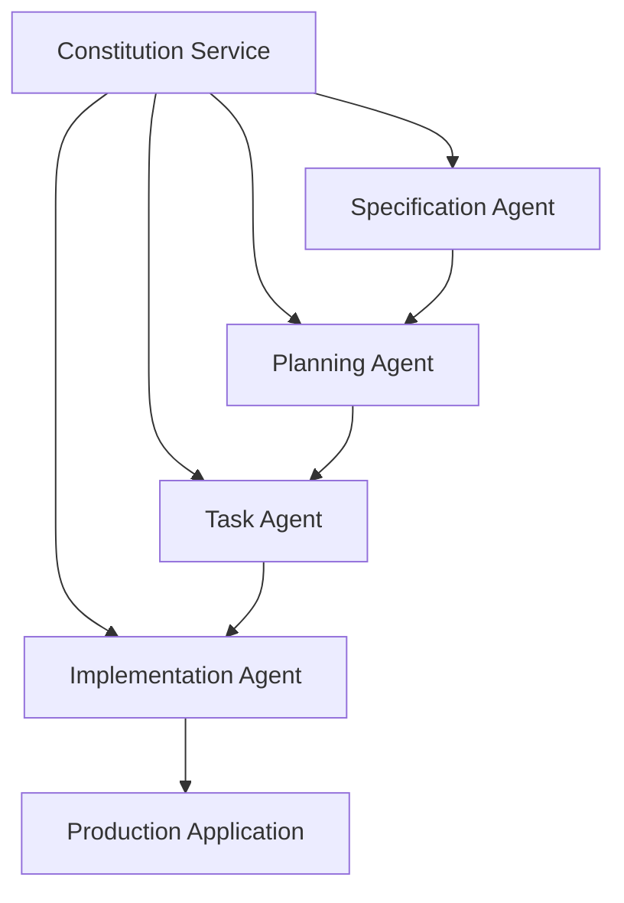

# SaaS Architecture Spec-Kit (saasarch speckit)

**A systematic, spec-driven development platform for building production-ready applications with AI agents.**

---

## Overview

The SaaS Architecture Spec-Kit (saasarch speckit) is an innovative platform that enhances the existing `saasarch` framework with a systematic, spec-driven approach to AI agent development. It provides a comprehensive ecosystem of specialized AI agents that work together to transform specifications into high-quality, production-ready applications.

This platform is designed to dramatically improve development efficiency, ensure constitutional compliance, and enforce enterprise-grade security and quality standards throughout the entire software development lifecycle.

### Key Goals

- **Systematic Development**: Introduce a structured, repeatable process for building AI-powered applications.
- **Specification-Driven**: Use formal specifications as the single source of truth for development.
- **Constitutional Compliance**: Enforce development principles, security standards, and quality guidelines through a central Constitution Service.
- **AI-Powered Automation**: Leverage specialized AI agents to automate all aspects of development, from planning and design to implementation and testing.
- **Enterprise-Grade Quality**: Deliver production-ready applications that meet the highest standards of security, reliability, and performance.

## System Architecture

The saasarch speckit platform is built on a microservices-based architecture with a central Constitution Service that acts as the system's backbone. All other agents and services in the ecosystem must comply with the principles enforced by the Constitution Service.



### Core Components

- **Constitution Service**: The central authority for enforcing development principles and ensuring compliance.
- **Specification Agent**: Manages project specifications, requirements, and documentation.
- **Planning Agent**: Transforms specifications into comprehensive, executable development plans.
- **Task Agent**: Breaks down plans into executable tasks and assigns them to specialized agents.
- **Implementation Agent**: Coordinates the actual implementation of tasks by various specialized agents.

### Specialized Agents

- **Agent Builder**: Creates new AI agents based on specifications.
- **UI Architect Agent**: Designs and implements modern user interfaces.
- **Crawler Agent**: Performs web crawling and data extraction.
- **Prompt Researcher**: Researches and optimizes prompts for AI interactions.

## Getting Started

### Prerequisites

- [Node.js](https://nodejs.org/) (v18 or later)
- [TypeScript](https://www.typescriptlang.org/)
- [PostgreSQL](https://www.postgresql.org/) (with pgvector extension)
- [Python](https://www.python.org/) (v3.9 or later)

### Installation

1.  **Clone the repository:**

    ```bash
    git clone https://github.com/vbonk/app-agents.git
    cd saas-spec-driven-development
    ```

2.  **Install dependencies for the Constitution Service:**

    ```bash
    cd services/constitution-service
    npm install
    ```

3.  **Set up the database:**

    - Create a PostgreSQL database named `constitution_service`.
    - Enable the `pgvector` extension.
    - Configure your database connection in `services/constitution-service/.env`.

4.  **Run database migrations:**

    ```bash
    npx prisma migrate dev --name init
    ```

5.  **Seed the database:**

    ```bash
    npm run db:seed
    ```

6.  **Start the Constitution Service:**

    ```bash
    npm run dev
    ```

### Running Tests

To run the comprehensive test suite, use the test runner script:

```bash
./scripts/run_tests.py
```

## Documentation

- **[User Guide](./docs/USER_GUIDE.md)**: A comprehensive guide for using the SaaS Spec-Driven Development Platform.
- **[Agent Registry](./docs/AGENT_REGISTRY.md)**: A complete registry of all AI agents in the system.
- **[Constitution Integration](./docs/CONSTITUTION_INTEGRATION.md)**: A guide for integrating the Constitution Service with existing agents.
- **[System Overview](./docs/SYSTEM_OVERVIEW.md)**: A comprehensive overview of the entire system.

## Contributing

We welcome contributions to the saasarch speckit platform! Please see our contributing guidelines for more information.

## License

This project is licensed under the MIT License. See the [LICENSE](LICENSE) file for details.

