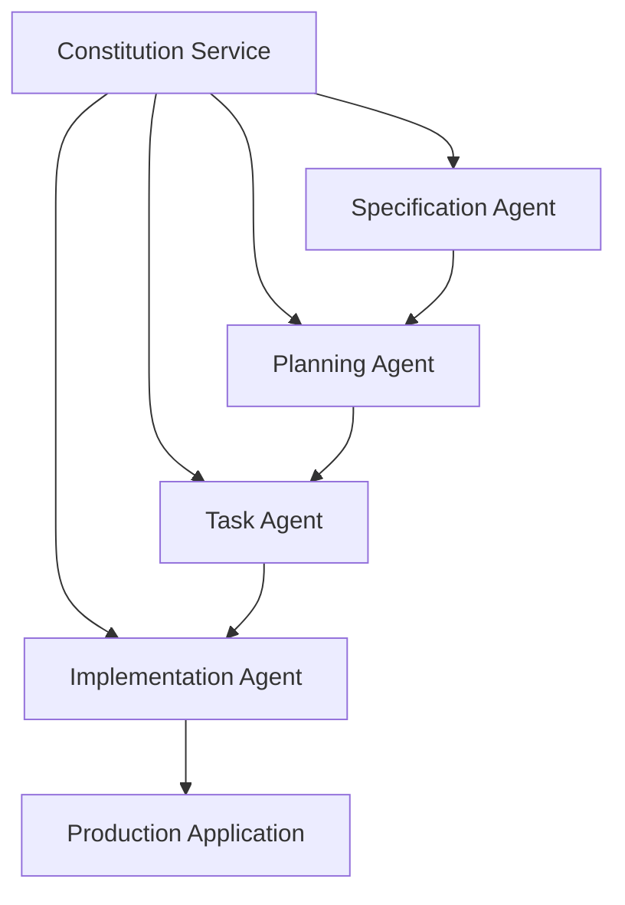

# SaaS Architecture Spec-Kit (saasarch speckit)

**Enterprise-grade spec-driven development platform integrating GitHub Spec-Kit methodology with SaaS Architecture ecosystem**

[](https://opensource.org/licenses/MIT)
[](https://github.com/vbonk/saas-spec-driven-development/actions)
[](https://github.com/vbonk/saas-spec-driven-development/security)

---

## Overview

The SaaS Architecture Spec-Kit (saasarch speckit) is an innovative platform that enhances the existing `saasarch` framework with a systematic, spec-driven approach to AI agent development. It transforms chaotic AI-assisted development into systematic, enterprise-grade software development through structured methodology and comprehensive platform integration.

This platform provides a comprehensive ecosystem of specialized AI agents that work together to transform specifications into high-quality, production-ready applications, ensuring constitutional compliance and enforcing enterprise-grade security and quality standards throughout the entire software development lifecycle.

### Key Value Propositions

**Systematic Development Methodology** replaces unstructured "vibe coding" with a proven five-phase approach that guides AI agents through Constitution establishment, Specification creation, Planning development, Task breakdown, and Implementation execution. This structured approach ensures consistent, high-quality outcomes across all development projects.

**Enterprise-Grade Multi-Tenancy** provides complete data isolation, tenant-specific configuration, and comprehensive security controls that meet enterprise requirements for compliance, governance, and scalability. The platform supports organizations from small teams to large enterprises with thousands of developers.

**Advanced AI Agent Orchestration** coordinates multiple AI coding assistants including GitHub Copilot, Claude Code, Gemini CLI, Cursor, Windsurf, Qwen CLI, and OpenCode through standardized interfaces and intelligent load balancing. This multi-agent approach leverages the strengths of different AI services while preventing conflicts and ensuring consistency.

**Constitutional Compliance** enforces development principles, security standards, and quality guidelines through a central Constitution Service that acts as the system's backbone. All other agents and services in the ecosystem must comply with the principles enforced by the Constitution Service.

## System Architecture

The saasarch speckit platform is built on a microservices-based architecture with a central Constitution Service that acts as the system's backbone. The platform implements a distributed microservices architecture with five core services that correspond to the Spec-Kit methodology phases.



### Core Components

**Constitution Service** manages project principles, development guidelines, and organizational governance within the multi-tenant environment. This service ensures consistent application of organizational standards and compliance requirements across all development projects.

**Specification Service** creates, validates, and versions detailed requirements using advanced natural language processing and vector embeddings for sophisticated queries and relationships. The service integrates with multiple AI providers to generate high-quality specifications and detect ambiguities.

**Planning Service** coordinates multiple AI agents for technical planning, architecture decisions, and implementation strategy development. This service includes agent capability discovery, load balancing, and conflict resolution mechanisms to optimize planning outcomes.

**Task Management Service** breaks down specifications into actionable tasks with sophisticated dependency management and parallel execution coordination. The service optimizes resource allocation and provides real-time progress tracking and analytics.

**Implementation Service** coordinates AI agent execution, code generation, quality assurance, and deployment management. This service ensures generated code meets organizational standards and integrates seamlessly with existing development workflows.

### Specialized Agents

- **Agent Builder**: Creates new AI agents based on specifications and requirements.
- **UI Architect Agent**: Designs and implements modern user interfaces following accessibility and design standards.
- **Crawler Agent**: Performs web crawling and data extraction with privacy and compliance awareness.
- **Prompt Researcher**: Researches and optimizes prompts for AI interactions and agent communications.

### Technology Stack

**Backend Services**: Node.js/Express and Python/FastAPI for high-performance, scalable service implementation  
**Database**: PostgreSQL with pgvector extension for advanced semantic search and relationship mapping  
**Message Queue**: Apache Kafka for reliable, scalable event-driven communication  
**Caching**: Redis for high-performance caching and session management  
**Container Orchestration**: Docker and Kubernetes for scalable, reliable deployment  
**Monitoring**: Comprehensive observability with Prometheus, Grafana, and distributed tracing

## Getting Started

### Prerequisites

<<<<<<< HEAD
Before setting up the SaaS Spec-Driven Development Platform, ensure you have the following prerequisites installed and configured:

- **Docker and Docker Compose** (version 20.10 or higher) for containerized development and deployment
- **Node.js** (version 18 or higher) and **Python** (version 3.9 or higher) for service development
- **PostgreSQL** (version 14 or higher) with pgvector extension for database functionality
- **Git** for version control and repository management
- **Access to AI Services** including API keys for supported AI providers

### Quick Start

```bash
# Clone the repository
git clone https://github.com/vbonk/saas-spec-driven-development.git
cd saas-spec-driven-development

# Set up environment variables
cp .env.example .env
# Edit .env with your configuration

# Start the development environment
docker-compose up -d

# Run database migrations
npm run migrate

# Start the services
npm run dev
```

### Configuration

The platform uses environment-based configuration with support for multiple deployment environments. Key configuration areas include:

**Database Configuration** requires PostgreSQL connection details, pgvector extension setup, and multi-tenant schema configuration. The platform supports both single-database and database-per-tenant architectures.

**AI Service Integration** requires API keys and configuration for supported AI providers. The platform includes intelligent fallback and load balancing across multiple providers to ensure reliability and performance.

**Security Configuration** includes authentication provider setup, encryption key management, and compliance policy configuration. The platform integrates with existing SaaS platform security infrastructure.

**Monitoring and Observability** configuration includes metrics collection, logging aggregation, and alerting setup. Comprehensive monitoring ensures optimal performance and rapid issue resolution.

## Core Features

### Spec-Kit Methodology Integration

**Five-Phase Development Process** guides teams through systematic development with Constitution establishment, Specification creation, Planning development, Task breakdown, and Implementation execution. Each phase includes validation, quality gates, and comprehensive documentation.

**AI-Assisted Specification Generation** leverages multiple AI providers to create high-quality specifications from user prompts. The system includes ambiguity detection, clarification requests, and quality scoring to ensure specification completeness and accuracy.

**Multi-Agent Coordination** orchestrates multiple AI coding assistants to work collaboratively on complex development tasks. The platform prevents conflicts, optimizes resource allocation, and ensures consistent code quality across all generated components.

### Enterprise Capabilities

**Multi-Tenant Architecture** provides complete data isolation, tenant-specific configuration, and comprehensive security controls. The platform supports organizations with complex hierarchies, multiple teams, and diverse compliance requirements.

**Organizational Knowledge Management** captures development patterns, architectural decisions, and best practices to accelerate future development. The knowledge system learns from organizational experience and provides intelligent recommendations.

**Comprehensive Audit Trails** track all development activities, decisions, and changes for compliance and governance requirements. Audit capabilities support forensic analysis, compliance reporting, and continuous improvement initiatives.

**Advanced Analytics and Reporting** provide insights into development efficiency, quality metrics, and organizational performance. Analytics support both operational monitoring and strategic decision-making.

### Integration Ecosystem

**SaaS Platform Integration** leverages existing platform services for authentication, tenant management, billing, and monitoring. Integration follows established platform patterns and maintains consistency with existing services.

**Development Tool Integration** supports popular IDEs, version control systems, project management tools, and CI/CD pipelines through comprehensive APIs and webhooks. Integration enables seamless workflow integration without disrupting existing processes.

**Third-Party Service Integration** includes support for additional AI providers, cloud services, and enterprise tools through standardized integration patterns and comprehensive documentation.

## API Documentation

### RESTful API Design

The platform provides comprehensive RESTful APIs following OpenAPI 3.0 specifications with detailed documentation, versioning strategies, and backward compatibility guarantees. All APIs implement consistent error handling, pagination, and filtering patterns.

**Authentication and Authorization** integrate with OAuth 2.0 and JWT token systems with fine-grained permissions and role-based access control. API security includes rate limiting, throttling, and comprehensive audit trails.

**Service APIs** provide complete access to all platform functionality including constitution management, specification creation, planning coordination, task management, and implementation execution. APIs support both synchronous and asynchronous operations.

### API Examples

```javascript
// Create a new specification
const specification = await fetch('/api/v1/specifications', {
  method: 'POST',
  headers: {
    'Authorization': 'Bearer ' + token,
    'Content-Type': 'application/json'
  },
  body: JSON.stringify({
    title: 'User Authentication System',
    description: 'Implement secure user authentication with multi-factor support',
    requirements: [...],
    acceptance_criteria: [...]
  })
});

// Coordinate multi-agent planning
const planningResult = await fetch('/api/v1/planning/coordinate', {
  method: 'POST',
  headers: {
    'Authorization': 'Bearer ' + token,
    'Content-Type': 'application/json'
  },
  body: JSON.stringify({
    specification_id: 'spec-123',
    agents: ['github-copilot', 'claude-code'],
    planning_type: 'architecture'
  })
});
```

## Development Guide

### Development Environment Setup

**Local Development** requires Docker Compose for service orchestration, database setup, and dependency management. The development environment includes hot reloading, comprehensive logging, and debugging capabilities.

**Testing Framework** implements comprehensive testing strategies including unit tests, integration tests, end-to-end tests, and performance tests. Testing automation ensures consistent quality and prevents regression issues.

**Code Quality Standards** include automated linting, code formatting, security scanning, and compliance validation. Quality gates prevent deployment of substandard code and ensure adherence to organizational standards.

### Contributing Guidelines

**Code Contribution Process** follows established patterns including feature branches, pull requests, code review, and automated testing. Contribution guidelines ensure consistent quality and maintainability.

**Documentation Requirements** include comprehensive API documentation, architectural decision records, and user guides. Documentation is maintained alongside code changes and validated through automated processes.

**Security and Compliance** requirements include security scanning, vulnerability assessment, and compliance validation for all contributions. Security reviews ensure adherence to enterprise security standards.

## Deployment and Operations

### Deployment Architecture

**Multi-Environment Support** includes development, staging, and production environments with environment-specific configuration and deployment automation. Deployment strategies include blue-green deployments, canary releases, and rolling updates.

**Infrastructure as Code** utilizes Terraform for infrastructure provisioning and management with version control and reproducible deployments. Infrastructure automation ensures consistent environments and rapid scaling.

**Container Orchestration** uses Docker and Kubernetes for scalable, reliable deployment with auto-scaling, health checks, and automated recovery. Container orchestration enables efficient resource utilization and high availability.

### Monitoring and Observability

**Comprehensive Monitoring** includes real-time metrics, distributed tracing, and structured logging across all services. Monitoring provides visibility into system health, performance, and business metrics.

**Alerting and Incident Response** implements intelligent alerting with escalation procedures and automated incident response. Alert management reduces false positives while ensuring critical issues receive immediate attention.

**Performance Analytics** provide insights into system performance, bottleneck identification, and capacity planning. Analytics support both reactive problem-solving and proactive optimization.

## Security and Compliance

### Security Framework

**Multi-Layered Security** implements comprehensive security controls including network security, application security, and data security. Security measures include encryption, access controls, and comprehensive audit trails.

**Compliance Implementation** supports SOC2, GDPR, and industry-specific compliance requirements through automated validation, reporting, and policy enforcement. Compliance capabilities ensure adherence to regulatory requirements.

**Incident Response** includes comprehensive incident response procedures with clear escalation paths and communication strategies. Response procedures are regularly tested and updated based on lessons learned.

### Data Protection

**Encryption and Key Management** implements encryption at rest and in transit with tenant-specific keys and comprehensive key management. Data protection ensures confidentiality and integrity of sensitive information.

**Access Controls** include role-based access control, fine-grained permissions, and comprehensive audit trails. Access controls ensure appropriate data access while maintaining security and compliance.

**Privacy Protection** implements privacy by design principles with data minimization, consent management, and data subject rights support. Privacy capabilities ensure compliance with privacy regulations and organizational policies.

## Performance and Scalability

### Performance Optimization

**Horizontal Scaling** enables scaling across multiple dimensions including service instances, database replicas, and geographic regions. Scaling strategies ensure optimal performance under varying load conditions.

**Caching Strategies** implement multi-layer caching including application caches, database query caches, and content delivery networks. Caching optimization ensures fast response times and efficient resource utilization.

**Performance Monitoring** tracks key performance indicators including response times, throughput, error rates, and resource utilization. Performance analytics support both operational monitoring and capacity planning.

### Scalability Architecture

**Microservices Design** enables independent scaling of individual services based on demand and resource requirements. Service isolation ensures that performance issues in one service don't impact others.

**Database Optimization** includes query optimization, index management, connection pooling, and read replicas. Database performance ensures fast data access and efficient resource utilization.

**Load Balancing** implements intelligent load balancing algorithms that consider service health, response times, and resource utilization. Load balancing ensures optimal resource utilization and high availability.

## Support and Community

### Documentation and Resources

**Comprehensive Documentation** includes user guides, API documentation, architectural guides, and troubleshooting resources. Documentation is maintained alongside code changes and regularly updated.

**Training and Certification** programs provide comprehensive training for users, administrators, and developers. Training resources include hands-on workshops, video tutorials, and certification assessments.

**Community Support** includes forums, discussion groups, and community-contributed resources. Community engagement enables knowledge sharing and collaborative problem-solving.

### Professional Support

**Enterprise Support** provides dedicated support for enterprise customers with guaranteed response times and escalation procedures. Enterprise support includes architectural consulting and custom integration assistance.

**Consulting Services** offer implementation assistance, best practices guidance, and custom development services. Consulting services ensure successful platform adoption and optimization.

**Training and Workshops** provide on-site and remote training options for teams and organizations. Training programs are customized based on organizational needs and technical requirements.

## Roadmap and Future Development

### Current Development Focus

**Phase 1 Implementation** focuses on core services, basic multi-agent coordination, and SaaS platform integration. Current development priorities include foundation services and essential functionality.

**Quality and Performance** improvements include comprehensive testing, performance optimization, and security enhancements. Quality initiatives ensure enterprise-grade reliability and performance.

**Integration Expansion** includes additional AI providers, development tools, and enterprise services. Integration expansion supports diverse organizational requirements and workflows.

### Future Enhancements

**Advanced AI Capabilities** will include predictive analytics, intelligent automation, and enhanced natural language processing. AI enhancements will improve development efficiency and quality.

**Organizational Intelligence** will provide advanced analytics, pattern recognition, and organizational insights. Intelligence capabilities will enable data-driven decision-making and continuous improvement.

**Ecosystem Expansion** will include mobile applications, offline capabilities, and industry-specific adaptations. Ecosystem growth will support diverse use cases and deployment scenarios.

## License and Legal

This project is licensed under the MIT License - see the [LICENSE](LICENSE) file for details.

### Third-Party Licenses

The platform includes various third-party components with their respective licenses. All third-party licenses are documented and comply with enterprise licensing requirements.

### Compliance and Certifications

The platform is designed to meet enterprise compliance requirements including SOC2, GDPR, and industry-specific regulations. Compliance documentation and certifications are available for enterprise customers.

---

**Repository**: https://github.com/vbonk/saas-spec-driven-development  
**Documentation**: [docs.saas-spec-driven-development.com](https://docs.saas-spec-driven-development.com)  
**Support**: [support@saas-spec-driven-development.com](mailto:support@saas-spec-driven-development.com)  
**Community**: [community.saas-spec-driven-development.com](https://community.saas-spec-driven-development.com)
=======
- [Node.js](https://nodejs.org/) (v18 or later)
- [TypeScript](https://www.typescriptlang.org/)
- [PostgreSQL](https://www.postgresql.org/) (with pgvector extension)
- [Python](https://www.python.org/) (v3.9 or later)

### Installation

1.  **Clone the repository:**

    ```bash
    git clone https://github.com/vbonk/app-agents.git
    cd saas-spec-driven-development
    ```

2.  **Install dependencies for the Constitution Service:**

    ```bash
    cd services/constitution-service
    npm install
    ```

3.  **Set up the database:**

    - Create a PostgreSQL database named `constitution_service`.
    - Enable the `pgvector` extension.
    - Configure your database connection in `services/constitution-service/.env`.

4.  **Run database migrations:**

    ```bash
    npx prisma migrate dev --name init
    ```

5.  **Seed the database:**

    ```bash
    npm run db:seed
    ```

6.  **Start the Constitution Service:**

    ```bash
    npm run dev
    ```

### Running Tests

To run the comprehensive test suite, use the test runner script:

```bash
./scripts/run_tests.py
```

## Documentation

- **[User Guide](./docs/USER_GUIDE.md)**: A comprehensive guide for using the SaaS Spec-Driven Development Platform.
- **[Agent Registry](./docs/AGENT_REGISTRY.md)**: A complete registry of all AI agents in the system.
- **[Constitution Integration](./docs/CONSTITUTION_INTEGRATION.md)**: A guide for integrating the Constitution Service with existing agents.
- **[System Overview](./docs/SYSTEM_OVERVIEW.md)**: A comprehensive overview of the entire system.

## Contributing

We welcome contributions to the saasarch speckit platform! Please see our contributing guidelines for more information.

## License

This project is licensed under the MIT License. See the [LICENSE](LICENSE) file for details.

>>>>>>> main
