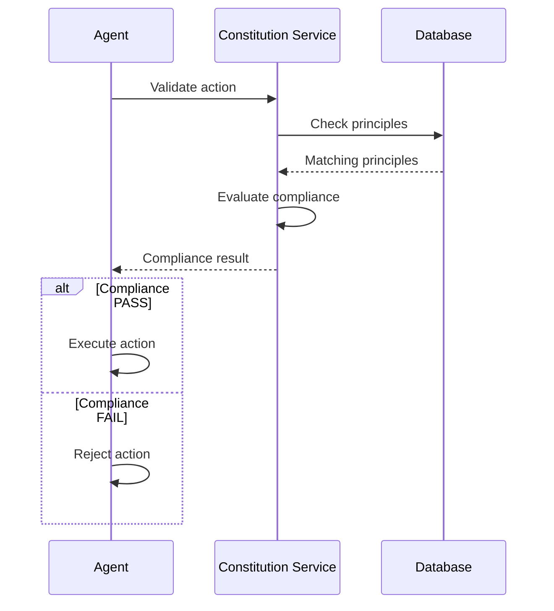
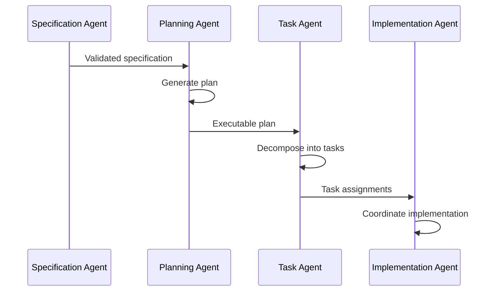
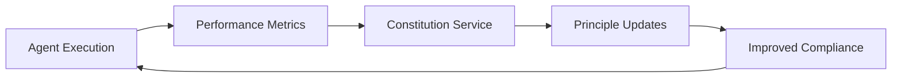

# Agent Registry

This document provides a comprehensive registry of all AI agents in the SaaS Architecture Spec-Kit (saasarch speckit) ecosystem, their capabilities, integration points, and current implementation status.

## Overview

The saasarch speckit platform consists of multiple specialized AI agents that work together to transform specifications into production-ready applications. Each agent has specific responsibilities and capabilities, and they collaborate through well-defined interfaces and the Constitution Service.

## Core Service Agents

### 1. Constitution Agent

**Status**: ✅ Implemented  
**Location**: `/services/constitution-service`  
**Purpose**: Central authority for enforcing development principles, security standards, and quality guidelines.

**Key Capabilities**:
- Constitutional principle management with vector embeddings
- Multi-tenant compliance isolation
- AI-powered action evaluation using OpenAI embeddings
- Comprehensive audit logging and compliance tracking
- Semantic similarity search for principle matching

**API Endpoints**:
- `POST /api/v1/evaluate` - Evaluate actions against principles
- `POST /api/v1/evaluate/batch` - Batch evaluation of multiple actions
- `GET /api/v1/principles` - Manage constitutional principles
- `GET /api/v1/tenants` - Multi-tenant management

**Integration Points**:
- All other agents for compliance validation
- OpenAI API for embeddings generation
- PostgreSQL with pgvector for vector storage

**Technology Stack**:
- Node.js/TypeScript with Express
- PostgreSQL with pgvector extension
- OpenAI Embeddings API
- Prisma ORM

---

### 2. Specification Agent

**Status**: 📋 Designed (Implementation Pending)  
**Location**: `/services/constitution-service/agents/specification-agent`  
**Purpose**: Manages project specifications, requirements documentation, and ensures specification quality.

**Key Capabilities**:
- Specification parsing and validation (Markdown, JSON, YAML, Gherkin)
- Requirements analysis for completeness and consistency
- Automated documentation generation
- Constitutional compliance validation for specifications
- Change impact analysis and version management
- Semantic search across specifications

**Planned API Endpoints**:
- `POST /specifications` - Create and manage specifications
- `POST /specifications/{id}/analyze` - Analyze specification quality
- `POST /specifications/{id}/validate` - Validate against principles
- `POST /specifications/search` - Semantic search

**Integration Points**:
- Constitution Service for compliance validation
- Planning Service for plan generation
- Agent Builder for agent specifications
- OpenAI API for content analysis

**Technology Stack**:
- Node.js/TypeScript with Express
- PostgreSQL with pgvector
- OpenAI API for analysis
- Prisma ORM

---

### 3. Planning Agent

**Status**: 📋 Designed (Implementation Pending)  
**Location**: `/services/constitution-service/agents/planning-agent`  
**Purpose**: Transforms validated specifications into comprehensive, executable development plans.

**Key Capabilities**:
- Automated plan generation from specifications
- Resource allocation optimization using genetic algorithms
- Timeline estimation with confidence intervals
- Risk assessment and mitigation planning
- Dependency management and critical path analysis
- Progress tracking and plan adjustment

**Planned API Endpoints**:
- `POST /plans` - Generate plans from specifications
- `POST /plans/{id}/optimize` - Optimize resource allocation
- `GET /plans/{id}/timeline` - Get detailed timeline
- `POST /plans/{id}/adjust` - Adjust plan based on progress

**Integration Points**:
- Constitution Service for plan compliance
- Specification Service for input specifications
- Task Service for task execution
- Agent Service for resource allocation

**Technology Stack**:
- Node.js/TypeScript with Express
- PostgreSQL with pgvector
- Machine learning models for optimization
- Prisma ORM

---

### 4. Task Agent

**Status**: 📋 Planned  
**Purpose**: Breaks down plans into executable tasks and manages their execution by specialized agents.

**Key Capabilities**:
- Task decomposition from plans
- Task assignment to appropriate agents
- Progress monitoring and reporting
- Quality assurance and validation
- Dependency resolution

---

### 5. Implementation Agent

**Status**: 📋 Planned  
**Purpose**: Coordinates the actual implementation of tasks by various specialized agents.

**Key Capabilities**:
- Code generation coordination
- Integration testing management
- Deployment automation
- Rollback capabilities
- Performance monitoring

## Specialized Development Agents

### 1. Agent Builder

**Status**: ✅ Implemented  
**Location**: `/app-agents/agents/agent-builder`  
**Purpose**: Creates new AI agents based on specifications and requirements.

**Key Capabilities**:
- Agent specification parsing and validation
- Automated code generation for agent logic
- Test generation and validation
- Documentation creation
- Integration with existing agent ecosystem

**API Integration**:
- Constitution Service for compliance validation
- GitHub API for code repository management
- OpenAI API for code generation assistance

**Example Usage**:
```python
from agent_builder import AgentBuilder

builder = AgentBuilder()
agent = builder.create_agent({
    "name": "DataProcessor",
    "type": "data_processing",
    "capabilities": ["csv_processing", "data_validation"],
    "tools": ["pandas", "numpy"]
})
```

**Technology Stack**:
- Python with advanced code generation
- OpenAI API integration
- GitHub API for repository management
- Automated testing frameworks

---

### 2. UI Architect Agent

**Status**: ✅ Implemented  
**Location**: `/app-agents/agents/ui-architect-agent`  
**Purpose**: Designs and implements user interfaces following modern UX/UI principles.

**Key Capabilities**:
- UI/UX design generation based on requirements
- Accessibility compliance checking (WCAG guidelines)
- Responsive design implementation
- Component library management
- Design system enforcement
- Modern framework integration (React, Vue, Angular)

**API Integration**:
- Constitution Service for accessibility compliance
- Design system repositories
- Frontend framework APIs

**Example Usage**:
```python
from ui_architect_agent import UIArchitectAgent

ui_agent = UIArchitectAgent()
design = ui_agent.create_interface({
    "type": "dashboard",
    "requirements": ["responsive", "accessible", "modern"],
    "framework": "react"
})
```

**Technology Stack**:
- Python with UI generation capabilities
- React/Vue/Angular integration
- Accessibility testing tools
- Design system libraries

---

### 3. Crawler Agent

**Status**: ✅ Implemented  
**Location**: `/app-agents/agents/crawler`  
**Purpose**: Performs web crawling and data extraction with privacy and compliance awareness.

**Key Capabilities**:
- Intelligent web crawling with rate limiting
- Privacy-compliant data extraction
- Structured data output generation
- Respectful crawling practices (robots.txt compliance)
- Data quality validation and cleaning

**API Integration**:
- Constitution Service for privacy compliance
- Data storage systems
- External APIs and web services

**Example Usage**:
```python
from crawler_agent import CrawlerAgent

crawler = CrawlerAgent()
data = crawler.crawl_site({
    "url": "https://example.com",
    "respect_robots": True,
    "rate_limit": 1.0,
    "data_types": ["text", "links"]
})
```

**Technology Stack**:
- Python with web scraping libraries
- BeautifulSoup, Scrapy integration
- Privacy compliance tools
- Data validation frameworks

---

### 4. Prompt Researcher

**Status**: ✅ Implemented  
**Location**: `/app-agents/agents/prompt-researcher`  
**Purpose**: Researches and optimizes prompts for AI interactions and agent communications.

**Key Capabilities**:
- Prompt effectiveness analysis and optimization
- A/B testing for prompt variations
- Context optimization for better results
- Multi-modal prompt support
- Performance metrics tracking and analysis

**API Integration**:
- All AI agents for prompt optimization
- Analytics systems for performance tracking
- Multiple AI service providers

**Example Usage**:
```python
from prompt_researcher import PromptResearcher

researcher = PromptResearcher()
optimized_prompt = researcher.optimize_prompt({
    "original": "Generate code for user authentication",
    "context": "web application",
    "target_model": "gpt-4"
})
```

**Technology Stack**:
- Python with AI model integration
- Multiple AI service APIs
- Analytics and metrics collection
- A/B testing frameworks

## Agent Interaction Patterns

### 1. Constitutional Compliance Pattern

All agents must validate their actions through the Constitution Service:



### 2. Agent Collaboration Pattern

Agents collaborate through well-defined interfaces:



### 3. Feedback Loop Pattern

Agents provide feedback to improve the system:



## Agent Communication Protocol

### Message Format

All inter-agent communication uses a standardized message format:

```typescript
interface AgentMessage {
  id: string;
  timestamp: Date;
  source: AgentIdentifier;
  target: AgentIdentifier;
  type: MessageType;
  payload: any;
  metadata: {
    tenantId: string;
    correlationId: string;
    priority: number;
  };
}

interface AgentIdentifier {
  name: string;
  version: string;
  instance: string;
}

enum MessageType {
  REQUEST = 'request',
  RESPONSE = 'response',
  EVENT = 'event',
  COMMAND = 'command'
}
```

### Communication Channels

1. **HTTP REST APIs**: For synchronous request-response patterns
2. **Message Queues**: For asynchronous event-driven communication
3. **WebSockets**: For real-time updates and streaming
4. **Database Events**: For data change notifications

## Agent Lifecycle Management

### 1. Agent Registration

```typescript
interface AgentRegistration {
  name: string;
  version: string;
  capabilities: Capability[];
  endpoints: Endpoint[];
  healthCheck: string;
  metadata: Record<string, any>;
}

interface Capability {
  name: string;
  description: string;
  inputSchema: JSONSchema;
  outputSchema: JSONSchema;
}
```

### 2. Health Monitoring

All agents implement standardized health checks:

```typescript
interface HealthStatus {
  status: 'healthy' | 'degraded' | 'unhealthy';
  timestamp: Date;
  version: string;
  checks: {
    database: CheckResult;
    externalServices: CheckResult;
    memory: CheckResult;
    cpu: CheckResult;
  };
}
```

### 3. Version Management

Agents support semantic versioning and backward compatibility:

```typescript
interface AgentVersion {
  version: string;
  releaseDate: Date;
  changes: ChangeLog[];
  compatibility: CompatibilityInfo;
  deprecationNotice?: DeprecationNotice;
}
```

## Development Guidelines

### 1. Agent Development Standards

- **Constitutional Compliance**: All agents must integrate with Constitution Service
- **Error Handling**: Implement comprehensive error handling and recovery
- **Logging**: Use structured logging with correlation IDs
- **Testing**: Maintain >90% test coverage
- **Documentation**: Provide comprehensive API documentation

### 2. Code Structure

```
agent-name/
├── src/
│   ├── agent.py              # Main agent implementation
│   ├── capabilities/         # Agent capabilities
│   ├── integrations/         # External integrations
│   └── utils/               # Utility functions
├── tests/
│   ├── unit/                # Unit tests
│   ├── integration/         # Integration tests
│   └── fixtures/            # Test fixtures
├── docs/
│   ├── README.md            # Agent documentation
│   ├── API.md               # API documentation
│   └── examples/            # Usage examples
├── agents.md                # Agent metadata
└── requirements.txt         # Dependencies
```

### 3. Testing Requirements

```python
# Example test structure
class TestAgentBuilder:
    def test_constitutional_compliance(self):
        """Test that agent validates actions with Constitution Service"""
        pass
    
    def test_error_handling(self):
        """Test proper error handling and recovery"""
        pass
    
    def test_performance(self):
        """Test performance meets requirements"""
        pass
    
    def test_integration(self):
        """Test integration with other agents"""
        pass
```

## Deployment and Operations

### 1. Container Configuration

All agents are containerized using Docker:

```dockerfile
FROM python:3.11-slim
WORKDIR /app
COPY requirements.txt .
RUN pip install -r requirements.txt
COPY src/ ./src/
EXPOSE 8000
CMD ["python", "-m", "src.agent"]
```

### 2. Kubernetes Deployment

```yaml
apiVersion: apps/v1
kind: Deployment
metadata:
  name: agent-builder
spec:
  replicas: 2
  selector:
    matchLabels:
      app: agent-builder
  template:
    metadata:
      labels:
        app: agent-builder
    spec:
      containers:
      - name: agent-builder
        image: saasarch/agent-builder:latest
        ports:
        - containerPort: 8000
        env:
        - name: CONSTITUTION_SERVICE_URL
          value: "http://constitution-service:80"
```

### 3. Monitoring and Observability

- **Metrics**: Prometheus metrics for performance monitoring
- **Logging**: Structured logging with ELK stack
- **Tracing**: Distributed tracing with Jaeger
- **Alerting**: Alert manager for critical issues

## Future Roadmap

### Phase 1 (Current - Q1 2024)
- ✅ Constitution Service implementation
- ✅ Basic agent implementations (Agent Builder, UI Architect, Crawler, Prompt Researcher)
- ✅ Constitutional compliance integration

### Phase 2 (Q2 2024)
- 🔄 Specification Service implementation
- 🔄 Planning Service implementation
- 🔄 Enhanced agent capabilities
- 🔄 Advanced constitutional compliance features

### Phase 3 (Q3 2024)
- 📋 Task Service implementation
- 📋 Implementation Service implementation
- 📋 Full workflow automation
- 📋 Advanced monitoring and analytics

### Phase 4 (Q4 2024)
- 📋 Machine learning integration
- 📋 Predictive analytics
- 📋 Advanced optimization algorithms
- 📋 Enterprise features

## Contributing

### Adding New Agents

1. **Design Phase**: Create design document following the template
2. **Implementation**: Implement agent following development standards
3. **Testing**: Comprehensive testing including constitutional compliance
4. **Documentation**: Complete documentation and examples
5. **Integration**: Integration with existing agent ecosystem
6. **Review**: Code review and approval process

### Agent Enhancement

1. **Proposal**: Submit enhancement proposal with rationale
2. **Design Review**: Review design changes with team
3. **Implementation**: Implement changes with backward compatibility
4. **Testing**: Comprehensive testing of changes
5. **Deployment**: Staged deployment with monitoring

## Support and Resources

- **Documentation**: Comprehensive guides in `/docs`
- **Examples**: Working examples in each agent directory
- **API Reference**: OpenAPI specifications for all services
- **Community**: GitHub Discussions for community support
- **Issues**: GitHub Issues for bug reports and feature requests

---

**Agent Registry** - Central directory of all AI agents in the SaaS Architecture Spec-Kit ecosystem, enabling coordinated development and constitutional compliance across the platform.
