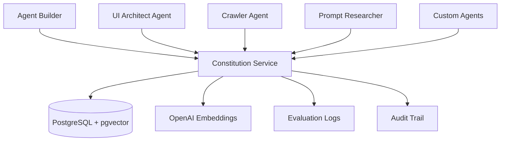

# Constitution Service Integration Guide

This guide explains how to integrate the Constitution Service with existing agents in the SaaS Architecture Spec-Kit ecosystem to ensure constitutional compliance across all AI-driven development workflows.

## Overview

The Constitution Service acts as the central authority for enforcing development principles, security standards, and quality guidelines across all agents. Each agent should consult the Constitution Service before taking actions that could impact system integrity, security, or compliance.

## Integration Architecture



## Integration Patterns

### 1. Pre-Action Validation

Agents should validate actions before execution:

```javascript
// Example: Agent Builder validating code generation
class AgentBuilder {
  async generateCode(specification) {
    const proposedCode = await this.generateFromSpec(specification);
    
    // Validate against constitutional principles
    const evaluation = await this.constitutionService.evaluate({
      action: `Generate code: ${proposedCode}`,
      tenantId: this.tenantId,
      metadata: {
        agent: 'agent-builder',
        specification: specification.id
      }
    });
    
    if (evaluation.compliance === 'FAIL') {
      throw new ConstitutionalViolationError(
        `Code generation violates principles: ${evaluation.violations.map(v => v.description).join(', ')}`
      );
    }
    
    if (evaluation.compliance === 'WARNING') {
      console.warn('Code generation has potential issues:', evaluation.recommendations);
    }
    
    return proposedCode;
  }
}
```

### 2. Continuous Monitoring

Agents should log ongoing activities for compliance monitoring:

```javascript
// Example: Crawler Agent monitoring data collection
class CrawlerAgent {
  async crawlWebsite(url, options) {
    // Log the crawling action
    const evaluation = await this.constitutionService.evaluate({
      action: `Crawl website: ${url} with options: ${JSON.stringify(options)}`,
      tenantId: this.tenantId,
      metadata: {
        agent: 'crawler',
        url,
        timestamp: new Date().toISOString()
      }
    });
    
    // Check for privacy and security compliance
    const privacyViolations = evaluation.violations.filter(v => v.category === 'Privacy');
    if (privacyViolations.length > 0) {
      throw new PrivacyViolationError('Crawling action violates privacy principles');
    }
    
    // Proceed with crawling
    return await this.performCrawl(url, options);
  }
}
```

### 3. Batch Evaluation

For agents performing multiple actions, use batch evaluation:

```javascript
// Example: UI Architect Agent validating multiple components
class UIArchitectAgent {
  async generateUIComponents(specifications) {
    const components = await Promise.all(
      specifications.map(spec => this.generateComponent(spec))
    );
    
    // Batch evaluate all components
    const actions = components.map((component, index) => 
      `Generate UI component ${specifications[index].name}: ${component.code}`
    );
    
    const batchEvaluation = await this.constitutionService.evaluateBatch({
      actions,
      tenantId: this.tenantId,
      metadata: {
        agent: 'ui-architect',
        componentCount: components.length
      }
    });
    
    // Filter out components that violate principles
    const validComponents = components.filter((component, index) => 
      batchEvaluation.results[index].compliance !== 'FAIL'
    );
    
    return validComponents;
  }
}
```

## Agent-Specific Integration Examples

### Agent Builder Integration

The Agent Builder should validate all generated code and agent specifications:

```javascript
// Enhanced Agent Builder with Constitution Service
class EnhancedAgentBuilder extends AgentBuilder {
  constructor(constitutionService, tenantId) {
    super();
    this.constitutionService = constitutionService;
    this.tenantId = tenantId;
  }
  
  async buildAgent(specification) {
    // Validate the specification itself
    await this.validateSpecification(specification);
    
    // Generate agent code
    const agentCode = await this.generateAgentCode(specification);
    
    // Validate generated code
    await this.validateGeneratedCode(agentCode);
    
    // Generate tests
    const testCode = await this.generateTests(specification);
    
    // Validate test coverage and quality
    await this.validateTests(testCode);
    
    return {
      code: agentCode,
      tests: testCode,
      specification
    };
  }
  
  async validateSpecification(spec) {
    const evaluation = await this.constitutionService.evaluate({
      action: `Create agent with specification: ${JSON.stringify(spec)}`,
      tenantId: this.tenantId
    });
    
    if (evaluation.compliance === 'FAIL') {
      throw new Error(`Specification violates principles: ${evaluation.violations}`);
    }
  }
  
  async validateGeneratedCode(code) {
    const evaluation = await this.constitutionService.evaluate({
      action: `Generated agent code: ${code}`,
      tenantId: this.tenantId
    });
    
    if (evaluation.compliance === 'FAIL') {
      throw new Error(`Generated code violates principles: ${evaluation.violations}`);
    }
  }
}
```

### UI Architect Agent Integration

The UI Architect Agent should ensure accessibility and design compliance:

```javascript
// Enhanced UI Architect with Constitution Service
class EnhancedUIArchitectAgent extends UIArchitectAgent {
  async designInterface(requirements) {
    // Generate initial design
    const design = await this.generateDesign(requirements);
    
    // Validate accessibility compliance
    const accessibilityEvaluation = await this.constitutionService.evaluate({
      action: `Create UI design: ${JSON.stringify(design)}`,
      tenantId: this.tenantId,
      metadata: {
        agent: 'ui-architect',
        designType: requirements.type
      }
    });
    
    // Check for accessibility violations
    const accessibilityViolations = accessibilityEvaluation.violations.filter(
      v => v.category === 'Accessibility'
    );
    
    if (accessibilityViolations.length > 0) {
      // Auto-fix accessibility issues
      design = await this.fixAccessibilityIssues(design, accessibilityViolations);
    }
    
    return design;
  }
  
  async fixAccessibilityIssues(design, violations) {
    for (const violation of violations) {
      if (violation.description.includes('alt text')) {
        design = this.addAltText(design);
      }
      if (violation.description.includes('color contrast')) {
        design = this.improveColorContrast(design);
      }
      // Add more auto-fixes as needed
    }
    return design;
  }
}
```

### Crawler Agent Integration

The Crawler Agent should respect privacy and data protection principles:

```javascript
// Enhanced Crawler with Constitution Service
class EnhancedCrawlerAgent extends CrawlerAgent {
  async crawlSite(url, options = {}) {
    // Pre-crawl validation
    const preCrawlEvaluation = await this.constitutionService.evaluate({
      action: `Plan to crawl website: ${url}`,
      tenantId: this.tenantId,
      metadata: {
        agent: 'crawler',
        url,
        options
      }
    });
    
    if (preCrawlEvaluation.compliance === 'FAIL') {
      throw new Error(`Crawling plan violates principles: ${preCrawlEvaluation.violations}`);
    }
    
    // Perform crawling with constitutional constraints
    const crawlResults = await this.performConstitutionalCrawl(url, options);
    
    // Post-crawl validation
    const postCrawlEvaluation = await this.constitutionService.evaluate({
      action: `Completed crawling of ${url}, collected ${crawlResults.pageCount} pages`,
      tenantId: this.tenantId,
      metadata: {
        agent: 'crawler',
        url,
        pageCount: crawlResults.pageCount,
        dataTypes: crawlResults.dataTypes
      }
    });
    
    return {
      ...crawlResults,
      complianceScore: postCrawlEvaluation.overallScore,
      recommendations: postCrawlEvaluation.recommendations
    };
  }
  
  async performConstitutionalCrawl(url, options) {
    // Implement crawling with built-in privacy protections
    const results = {
      pages: [],
      pageCount: 0,
      dataTypes: []
    };
    
    // Add constitutional constraints to crawling logic
    // - Respect robots.txt
    // - Avoid personal data collection
    // - Implement rate limiting
    // - Log all actions for audit
    
    return results;
  }
}
```

## Configuration and Setup

### 1. Environment Configuration

Each agent should be configured with Constitution Service access:

```javascript
// config/constitution.js
export const constitutionConfig = {
  serviceUrl: process.env.CONSTITUTION_SERVICE_URL || 'http://localhost:3001',
  apiKey: process.env.CONSTITUTION_API_KEY,
  tenantId: process.env.TENANT_ID || 'default',
  timeout: 5000,
  retryAttempts: 3
};
```

### 2. Constitution Service Client

Create a shared client for all agents:

```javascript
// lib/constitution-client.js
export class ConstitutionClient {
  constructor(config) {
    this.config = config;
    this.baseUrl = `${config.serviceUrl}/api/v1`;
  }
  
  async evaluate(action, tenantId, metadata = {}) {
    const response = await fetch(`${this.baseUrl}/evaluate`, {
      method: 'POST',
      headers: {
        'Content-Type': 'application/json',
        'Authorization': `Bearer ${this.config.apiKey}`
      },
      body: JSON.stringify({
        action,
        tenantId: tenantId || this.config.tenantId,
        metadata
      })
    });
    
    if (!response.ok) {
      throw new Error(`Constitution Service error: ${response.statusText}`);
    }
    
    return await response.json();
  }
  
  async evaluateBatch(actions, tenantId, metadata = {}) {
    const response = await fetch(`${this.baseUrl}/evaluate/batch`, {
      method: 'POST',
      headers: {
        'Content-Type': 'application/json',
        'Authorization': `Bearer ${this.config.apiKey}`
      },
      body: JSON.stringify({
        actions,
        tenantId: tenantId || this.config.tenantId,
        metadata
      })
    });
    
    if (!response.ok) {
      throw new Error(`Constitution Service error: ${response.statusText}`);
    }
    
    return await response.json();
  }
  
  async searchPrinciples(query, limit = 10, threshold = 0.7) {
    const response = await fetch(`${this.baseUrl}/principles/search`, {
      method: 'POST',
      headers: {
        'Content-Type': 'application/json',
        'Authorization': `Bearer ${this.config.apiKey}`
      },
      body: JSON.stringify({
        query,
        limit,
        threshold
      })
    });
    
    return await response.json();
  }
}
```

### 3. Agent Base Class

Create a base class that all agents can extend:

```javascript
// lib/constitutional-agent.js
export class ConstitutionalAgent {
  constructor(name, constitutionClient, tenantId) {
    this.name = name;
    this.constitutionClient = constitutionClient;
    this.tenantId = tenantId;
  }
  
  async validateAction(action, metadata = {}) {
    const evaluation = await this.constitutionClient.evaluate(
      action,
      this.tenantId,
      {
        ...metadata,
        agent: this.name,
        timestamp: new Date().toISOString()
      }
    );
    
    if (evaluation.compliance === 'FAIL') {
      throw new ConstitutionalViolationError(
        `Action violates constitutional principles`,
        evaluation
      );
    }
    
    if (evaluation.compliance === 'WARNING') {
      console.warn(`Constitutional warning for ${this.name}:`, evaluation.recommendations);
    }
    
    return evaluation;
  }
  
  async logActivity(activity, result, metadata = {}) {
    await this.constitutionClient.evaluate(
      `${this.name} completed activity: ${activity}`,
      this.tenantId,
      {
        ...metadata,
        agent: this.name,
        activity,
        result: typeof result === 'object' ? JSON.stringify(result) : result,
        timestamp: new Date().toISOString()
      }
    );
  }
}

export class ConstitutionalViolationError extends Error {
  constructor(message, evaluation) {
    super(message);
    this.name = 'ConstitutionalViolationError';
    this.evaluation = evaluation;
  }
}
```

## Best Practices

### 1. Fail-Safe Defaults

Always implement fail-safe behavior when the Constitution Service is unavailable:

```javascript
async validateAction(action) {
  try {
    return await this.constitutionClient.evaluate(action, this.tenantId);
  } catch (error) {
    console.error('Constitution Service unavailable:', error);
    
    // Fail-safe: Apply basic validation rules
    return this.applyBasicValidation(action);
  }
}
```

### 2. Caching and Performance

Cache frequently accessed principles to reduce API calls:

```javascript
class CachedConstitutionClient extends ConstitutionClient {
  constructor(config) {
    super(config);
    this.principleCache = new Map();
    this.cacheTimeout = 5 * 60 * 1000; // 5 minutes
  }
  
  async searchPrinciples(query, limit, threshold) {
    const cacheKey = `${query}-${limit}-${threshold}`;
    const cached = this.principleCache.get(cacheKey);
    
    if (cached && Date.now() - cached.timestamp < this.cacheTimeout) {
      return cached.data;
    }
    
    const result = await super.searchPrinciples(query, limit, threshold);
    this.principleCache.set(cacheKey, {
      data: result,
      timestamp: Date.now()
    });
    
    return result;
  }
}
```

### 3. Monitoring and Alerting

Implement monitoring for constitutional compliance:

```javascript
class MonitoredConstitutionClient extends ConstitutionClient {
  async evaluate(action, tenantId, metadata) {
    const startTime = Date.now();
    
    try {
      const result = await super.evaluate(action, tenantId, metadata);
      
      // Log metrics
      this.logMetrics({
        action: 'evaluate',
        duration: Date.now() - startTime,
        compliance: result.compliance,
        score: result.overallScore
      });
      
      // Alert on violations
      if (result.compliance === 'FAIL') {
        this.alertOnViolation(action, result);
      }
      
      return result;
    } catch (error) {
      this.logError('evaluate', error);
      throw error;
    }
  }
  
  alertOnViolation(action, evaluation) {
    // Implement alerting logic (email, Slack, etc.)
    console.error('CONSTITUTIONAL VIOLATION:', {
      action,
      violations: evaluation.violations,
      score: evaluation.overallScore
    });
  }
}
```

## Testing Integration

### Unit Tests

Test constitutional compliance in your agent unit tests:

```javascript
// tests/agent-builder.test.js
describe('Agent Builder Constitutional Compliance', () => {
  let agentBuilder;
  let mockConstitutionService;
  
  beforeEach(() => {
    mockConstitutionService = {
      evaluate: jest.fn()
    };
    agentBuilder = new EnhancedAgentBuilder(mockConstitutionService, 'test-tenant');
  });
  
  test('should reject code that violates security principles', async () => {
    mockConstitutionService.evaluate.mockResolvedValue({
      compliance: 'FAIL',
      violations: [{ category: 'Security', description: 'Plain text passwords' }]
    });
    
    const badSpec = {
      name: 'BadAgent',
      code: 'const password = "plaintext";'
    };
    
    await expect(agentBuilder.buildAgent(badSpec)).rejects.toThrow('violates principles');
  });
  
  test('should accept compliant code', async () => {
    mockConstitutionService.evaluate.mockResolvedValue({
      compliance: 'PASS',
      overallScore: 0.9,
      violations: []
    });
    
    const goodSpec = {
      name: 'GoodAgent',
      code: 'const hashedPassword = bcrypt.hash(password);'
    };
    
    const result = await agentBuilder.buildAgent(goodSpec);
    expect(result).toBeDefined();
  });
});
```

### Integration Tests

Test the full integration with the Constitution Service:

```javascript
// tests/integration/constitution-integration.test.js
describe('Constitution Service Integration', () => {
  let constitutionClient;
  
  beforeAll(async () => {
    // Start test Constitution Service
    constitutionClient = new ConstitutionClient({
      serviceUrl: 'http://localhost:3001',
      tenantId: 'test-tenant'
    });
  });
  
  test('should evaluate real actions against principles', async () => {
    const evaluation = await constitutionClient.evaluate(
      'Store user passwords in plain text',
      'test-tenant'
    );
    
    expect(evaluation.compliance).toBe('FAIL');
    expect(evaluation.violations.length).toBeGreaterThan(0);
  });
});
```

## Troubleshooting

### Common Issues

1. **Service Unavailable**: Implement circuit breakers and fallback behavior
2. **Slow Response Times**: Use caching and batch operations
3. **High False Positives**: Tune similarity thresholds and add more specific principles
4. **Missing Principles**: Regularly review and update constitutional principles

### Debugging

Enable debug logging to troubleshoot integration issues:

```javascript
const constitutionClient = new ConstitutionClient({
  ...config,
  debug: true
});
```

## Conclusion

Integrating the Constitution Service with your agents ensures consistent adherence to organizational principles, security standards, and quality guidelines. By following these patterns and best practices, you can build a robust, compliant AI agent ecosystem that maintains high standards while enabling rapid development and deployment.

For more information, see:
- [Constitution Service API Documentation](../services/constitution-service/README.md)
- [Agent Development Guide](./AGENT_DEVELOPMENT.md)
- [Security Best Practices](./SECURITY.md)
