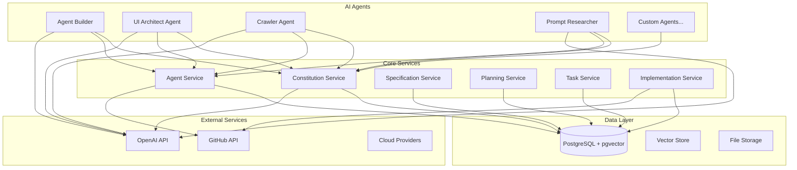
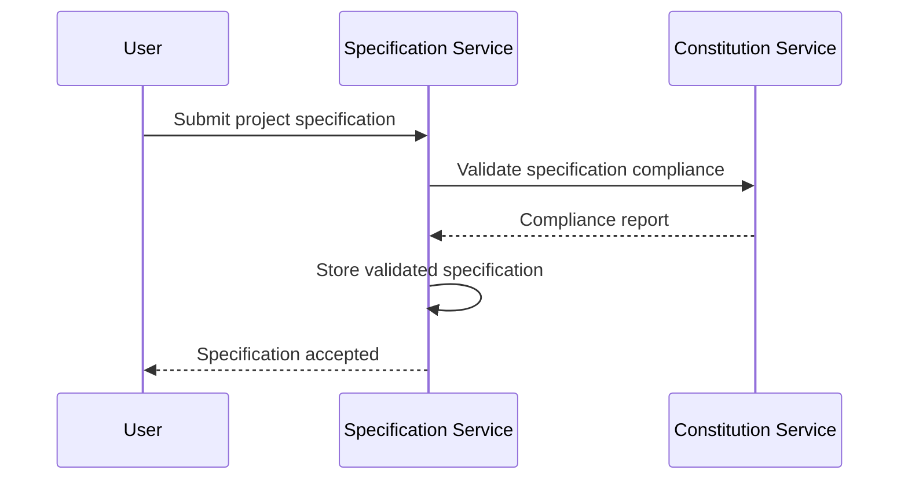
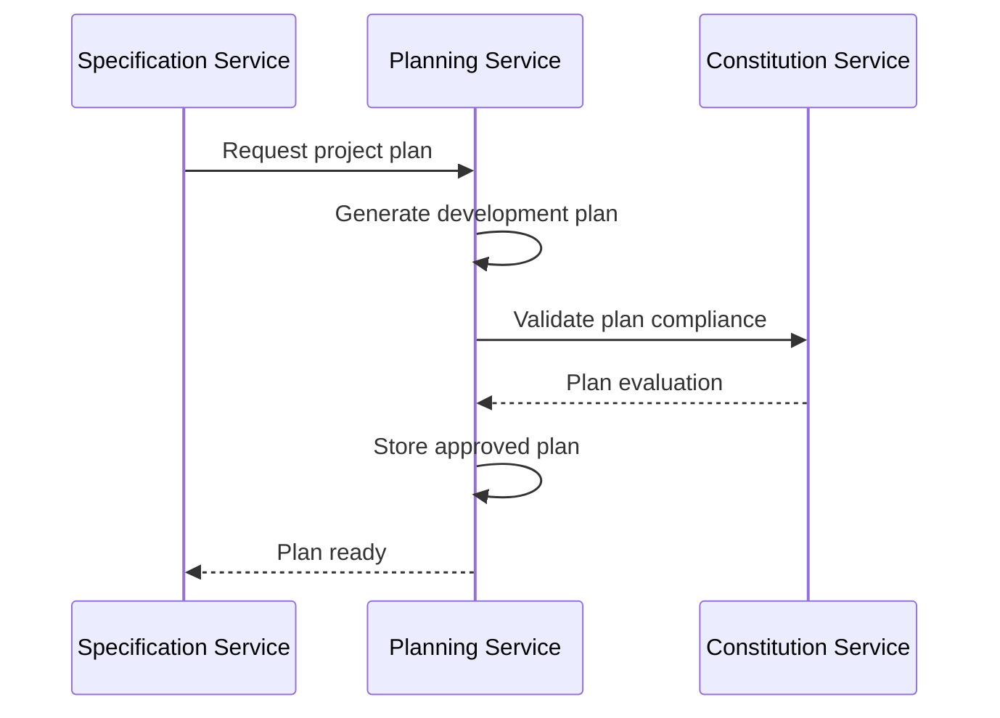
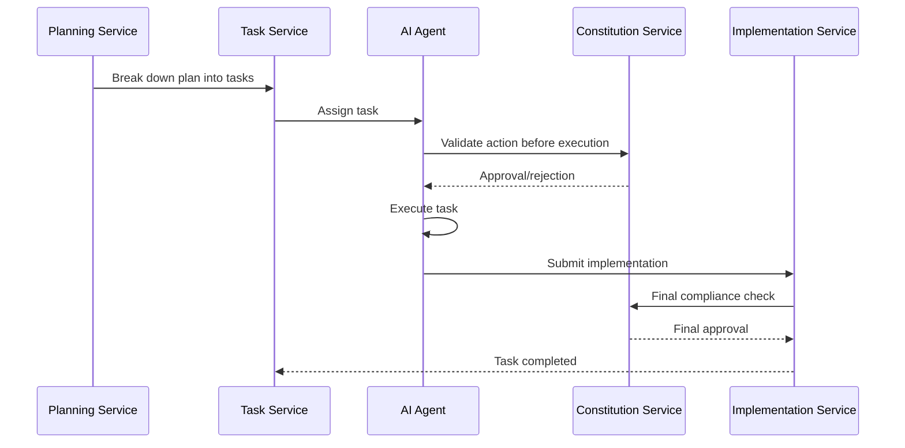

# SaaS Spec-Driven Development Platform - System Overview

## Introduction

The SaaS Spec-Driven Development Platform (saasarch speckit) is a comprehensive AI-powered development ecosystem that enhances traditional SaaS architecture patterns with intelligent agents, constitutional compliance, and systematic development workflows. This platform bridges the gap between high-level specifications and production-ready implementations through a network of specialized AI agents.

## Architecture Overview



## Core Components

### 1. Constitution Service

**Purpose**: Central authority for enforcing development principles, security standards, and quality guidelines.

**Key Features**:
- Constitutional principle management with vector embeddings
- Multi-tenant compliance isolation
- AI-powered action evaluation
- Comprehensive audit logging
- Semantic similarity search

**Technology Stack**:
- Node.js/TypeScript with Express
- PostgreSQL with pgvector extension
- OpenAI Embeddings API
- Prisma ORM

**API Endpoints**:
- `/api/v1/principles` - Principle management
- `/api/v1/tenants` - Multi-tenant management
- `/api/v1/evaluate` - Action evaluation
- `/api/v1/evaluate/batch` - Batch evaluation

### 2. Agent Service (Planned)

**Purpose**: Manages the lifecycle, deployment, and orchestration of AI agents.

**Key Features**:
- Agent registration and discovery
- Agent health monitoring
- Load balancing and scaling
- Inter-agent communication
- Agent versioning and updates

### 3. Specification Service (Planned)

**Purpose**: Manages project specifications, requirements, and documentation.

**Key Features**:
- Specification versioning
- Requirement traceability
- Automated documentation generation
- Specification validation
- Change impact analysis

### 4. Planning Service (Planned)

**Purpose**: Creates and manages development plans based on specifications.

**Key Features**:
- Automated project planning
- Resource allocation
- Timeline estimation
- Risk assessment
- Progress tracking

### 5. Task Service (Planned)

**Purpose**: Breaks down plans into executable tasks and manages their execution.

**Key Features**:
- Task decomposition
- Dependency management
- Task assignment to agents
- Progress monitoring
- Quality assurance

### 6. Implementation Service (Planned)

**Purpose**: Coordinates the actual implementation of tasks by various agents.

**Key Features**:
- Code generation coordination
- Integration testing
- Deployment automation
- Rollback capabilities
- Performance monitoring

## AI Agents

### 1. Agent Builder

**Purpose**: Creates new AI agents based on specifications and requirements.

**Capabilities**:
- Agent specification parsing
- Code generation for agent logic
- Test generation and validation
- Documentation creation
- Integration with existing systems

**Integration Points**:
- Constitution Service for compliance validation
- GitHub for code repository management
- OpenAI for code generation assistance

### 2. UI Architect Agent

**Purpose**: Designs and implements user interfaces following modern UX/UI principles.

**Capabilities**:
- UI/UX design generation
- Accessibility compliance checking
- Responsive design implementation
- Component library management
- Design system enforcement

**Integration Points**:
- Constitution Service for accessibility compliance
- Design system repositories
- Frontend frameworks (React, Vue, Angular)

### 3. Crawler Agent

**Purpose**: Performs web crawling and data extraction with privacy and compliance awareness.

**Capabilities**:
- Intelligent web crawling
- Data extraction and processing
- Privacy-compliant data handling
- Rate limiting and respectful crawling
- Structured data output

**Integration Points**:
- Constitution Service for privacy compliance
- Data storage systems
- External APIs and services

### 4. Prompt Researcher

**Purpose**: Researches and optimizes prompts for AI interactions and agent communications.

**Capabilities**:
- Prompt effectiveness analysis
- A/B testing for prompts
- Context optimization
- Multi-modal prompt support
- Performance metrics tracking

**Integration Points**:
- All AI agents for prompt optimization
- Analytics systems for performance tracking
- External AI services

## Data Architecture

### Database Design

The platform uses PostgreSQL with the pgvector extension for vector similarity search:

```sql
-- Core entities across services
CREATE TABLE tenants (
    id SERIAL PRIMARY KEY,
    name VARCHAR(255) NOT NULL,
    slug VARCHAR(100) UNIQUE NOT NULL,
    is_active BOOLEAN DEFAULT true,
    created_at TIMESTAMPTZ DEFAULT NOW(),
    updated_at TIMESTAMPTZ DEFAULT NOW()
);

CREATE TABLE principles (
    id SERIAL PRIMARY KEY,
    principle TEXT NOT NULL,
    embedding VECTOR(1536),
    category VARCHAR(255) NOT NULL,
    is_active BOOLEAN DEFAULT true,
    created_at TIMESTAMPTZ DEFAULT NOW(),
    updated_at TIMESTAMPTZ DEFAULT NOW()
);

CREATE TABLE agents (
    id SERIAL PRIMARY KEY,
    name VARCHAR(255) NOT NULL,
    type VARCHAR(100) NOT NULL,
    version VARCHAR(50) NOT NULL,
    specification JSONB,
    status VARCHAR(50) DEFAULT 'active',
    created_at TIMESTAMPTZ DEFAULT NOW(),
    updated_at TIMESTAMPTZ DEFAULT NOW()
);

CREATE TABLE specifications (
    id SERIAL PRIMARY KEY,
    title VARCHAR(255) NOT NULL,
    content TEXT NOT NULL,
    version VARCHAR(50) NOT NULL,
    tenant_id INTEGER REFERENCES tenants(id),
    status VARCHAR(50) DEFAULT 'draft',
    created_at TIMESTAMPTZ DEFAULT NOW(),
    updated_at TIMESTAMPTZ DEFAULT NOW()
);

CREATE TABLE plans (
    id SERIAL PRIMARY KEY,
    specification_id INTEGER REFERENCES specifications(id),
    content JSONB NOT NULL,
    estimated_duration INTEGER,
    status VARCHAR(50) DEFAULT 'pending',
    created_at TIMESTAMPTZ DEFAULT NOW(),
    updated_at TIMESTAMPTZ DEFAULT NOW()
);

CREATE TABLE tasks (
    id SERIAL PRIMARY KEY,
    plan_id INTEGER REFERENCES plans(id),
    title VARCHAR(255) NOT NULL,
    description TEXT,
    assigned_agent_id INTEGER REFERENCES agents(id),
    status VARCHAR(50) DEFAULT 'pending',
    priority INTEGER DEFAULT 5,
    created_at TIMESTAMPTZ DEFAULT NOW(),
    updated_at TIMESTAMPTZ DEFAULT NOW()
);
```

### Vector Storage

Vector embeddings are used throughout the platform for:
- Constitutional principle similarity matching
- Specification semantic search
- Agent capability matching
- Task-agent assignment optimization
- Code similarity analysis

## Development Workflow

### 1. Specification Phase



### 2. Planning Phase



### 3. Task Execution Phase



## Security and Compliance

### Constitutional Compliance

Every action in the platform is subject to constitutional review:

1. **Pre-Action Validation**: All agents must validate actions before execution
2. **Continuous Monitoring**: Ongoing compliance monitoring and logging
3. **Audit Trail**: Complete history of all actions and decisions
4. **Violation Response**: Automatic handling of compliance violations

### Security Measures

- **Multi-Tenant Isolation**: Complete data isolation between tenants
- **API Authentication**: JWT-based authentication for all services
- **Input Validation**: Comprehensive input sanitization and validation
- **Rate Limiting**: Protection against abuse and DoS attacks
- **Encryption**: Data encryption at rest and in transit
- **Audit Logging**: Comprehensive logging for security monitoring

## Deployment Architecture

### Microservices Deployment

```yaml
# docker-compose.yml example
version: '3.8'
services:
  constitution-service:
    build: ./services/constitution-service
    ports:
      - "3001:3001"
    environment:
      - DATABASE_URL=postgresql://postgres:password@db:5432/constitution
      - OPENAI_API_KEY=${OPENAI_API_KEY}
    depends_on:
      - db
      
  agent-service:
    build: ./services/agent-service
    ports:
      - "3002:3002"
    depends_on:
      - db
      - constitution-service
      
  specification-service:
    build: ./services/specification-service
    ports:
      - "3003:3003"
    depends_on:
      - db
      - constitution-service
      
  db:
    image: pgvector/pgvector:pg14
    environment:
      - POSTGRES_DB=saasarch_speckit
      - POSTGRES_USER=postgres
      - POSTGRES_PASSWORD=password
    volumes:
      - postgres_data:/var/lib/postgresql/data
      
volumes:
  postgres_data:
```

### Kubernetes Deployment

```yaml
# k8s/constitution-service.yaml
apiVersion: apps/v1
kind: Deployment
metadata:
  name: constitution-service
spec:
  replicas: 3
  selector:
    matchLabels:
      app: constitution-service
  template:
    metadata:
      labels:
        app: constitution-service
    spec:
      containers:
      - name: constitution-service
        image: saasarch/constitution-service:latest
        ports:
        - containerPort: 3001
        env:
        - name: DATABASE_URL
          valueFrom:
            secretKeyRef:
              name: db-secret
              key: url
        - name: OPENAI_API_KEY
          valueFrom:
            secretKeyRef:
              name: openai-secret
              key: api-key
---
apiVersion: v1
kind: Service
metadata:
  name: constitution-service
spec:
  selector:
    app: constitution-service
  ports:
  - port: 80
    targetPort: 3001
  type: LoadBalancer
```

## Monitoring and Observability

### Metrics Collection

- **Service Metrics**: Response times, error rates, throughput
- **Agent Metrics**: Task completion rates, success rates, performance
- **Compliance Metrics**: Violation rates, compliance scores, audit statistics
- **Business Metrics**: Project completion times, quality scores, user satisfaction

### Logging Strategy

```javascript
// Structured logging example
const logger = {
  info: (message, metadata) => {
    console.log(JSON.stringify({
      level: 'info',
      message,
      timestamp: new Date().toISOString(),
      service: process.env.SERVICE_NAME,
      ...metadata
    }));
  },
  
  error: (message, error, metadata) => {
    console.error(JSON.stringify({
      level: 'error',
      message,
      error: error.message,
      stack: error.stack,
      timestamp: new Date().toISOString(),
      service: process.env.SERVICE_NAME,
      ...metadata
    }));
  }
};
```

### Health Checks

Each service implements comprehensive health checks:

```javascript
// Health check endpoint
app.get('/health', async (req, res) => {
  const health = {
    status: 'healthy',
    timestamp: new Date().toISOString(),
    service: 'constitution-service',
    version: process.env.SERVICE_VERSION,
    checks: {
      database: await checkDatabase(),
      openai: await checkOpenAI(),
      memory: checkMemoryUsage(),
      disk: checkDiskUsage()
    }
  };
  
  const isHealthy = Object.values(health.checks).every(check => check.status === 'ok');
  res.status(isHealthy ? 200 : 503).json(health);
});
```

## Performance Optimization

### Caching Strategy

- **Redis Caching**: Frequently accessed data and computation results
- **Vector Caching**: Embedding vectors for common queries
- **API Response Caching**: Cacheable API responses
- **Database Query Optimization**: Indexed queries and connection pooling

### Scaling Considerations

- **Horizontal Scaling**: Stateless services with load balancing
- **Database Scaling**: Read replicas and connection pooling
- **Agent Scaling**: Dynamic agent provisioning based on workload
- **Caching Layers**: Multi-level caching for performance

## Development Guidelines

### Code Standards

- **TypeScript**: Strict typing for all services
- **ESLint/Prettier**: Consistent code formatting
- **Testing**: Comprehensive unit and integration tests
- **Documentation**: Inline documentation and API specs

### Git Workflow

```bash
# Feature development workflow
git checkout -b feature/new-agent-type
# Develop feature
git add .
git commit -m "feat: add new agent type support"
git push origin feature/new-agent-type
# Create pull request
# After review and approval, merge to main
```

### CI/CD Pipeline

```yaml
# .github/workflows/ci.yml
name: CI/CD Pipeline
on:
  push:
    branches: [main, develop]
  pull_request:
    branches: [main]

jobs:
  test:
    runs-on: ubuntu-latest
    steps:
    - uses: actions/checkout@v2
    - uses: actions/setup-node@v2
      with:
        node-version: '18'
    - run: npm ci
    - run: npm run test
    - run: npm run lint
    - run: npm run type-check
    
  build:
    needs: test
    runs-on: ubuntu-latest
    steps:
    - uses: actions/checkout@v2
    - run: docker build -t saasarch/constitution-service .
    - run: docker push saasarch/constitution-service:latest
    
  deploy:
    needs: build
    runs-on: ubuntu-latest
    if: github.ref == 'refs/heads/main'
    steps:
    - run: kubectl apply -f k8s/
```

## Future Roadmap

### Phase 1 (Current)
- ✅ Constitution Service implementation
- ✅ Basic agent integration patterns
- ✅ Core documentation and examples

### Phase 2 (Next 3 months)
- 🔄 Agent Service implementation
- 🔄 Specification Service implementation
- 🔄 Enhanced UI Architect Agent
- 🔄 Advanced crawler capabilities

### Phase 3 (6 months)
- 📋 Planning Service implementation
- 📋 Task Service implementation
- 📋 Implementation Service implementation
- 📋 Full workflow automation

### Phase 4 (12 months)
- 📋 Advanced AI capabilities
- 📋 Multi-cloud deployment
- 📋 Enterprise features
- 📋 Marketplace for custom agents

## Getting Started

### Prerequisites

- Node.js 18+
- PostgreSQL 14+ with pgvector
- Docker and Docker Compose
- OpenAI API key

### Quick Start

```bash
# Clone the repository
git clone https://github.com/your-org/saasarch-speckit.git
cd saasarch-speckit

# Start the infrastructure
docker-compose up -d

# Install dependencies
npm install

# Set up environment variables
cp .env.example .env
# Edit .env with your configuration

# Run database migrations
npm run db:migrate

# Seed initial data
npm run db:seed

# Start the services
npm run dev
```

### First Steps

1. **Create a tenant**: `POST /api/v1/tenants`
2. **Add constitutional principles**: `POST /api/v1/principles`
3. **Test evaluation**: `POST /api/v1/evaluate`
4. **Explore the agents**: Check `/agents` directory
5. **Read the documentation**: Browse `/docs` for detailed guides

## Support and Community

- **Documentation**: Comprehensive guides in `/docs`
- **Examples**: Working examples in `/examples`
- **Issues**: GitHub Issues for bug reports and feature requests
- **Discussions**: GitHub Discussions for community support
- **Contributing**: See `CONTRIBUTING.md` for contribution guidelines

---

**SaaS Spec-Driven Development Platform** - Transforming specifications into production-ready applications through intelligent AI agents and constitutional compliance.
