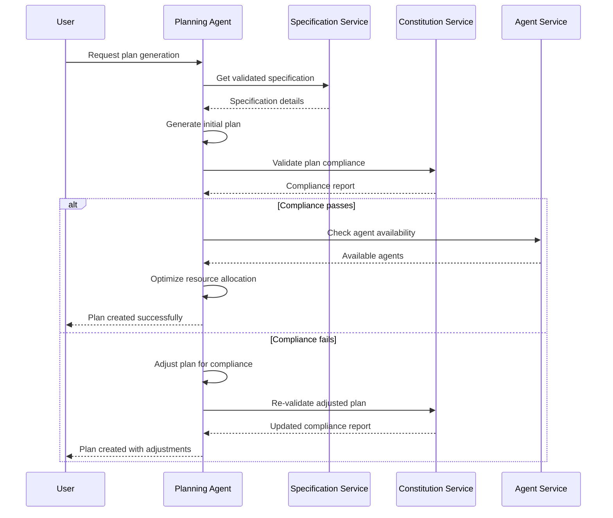
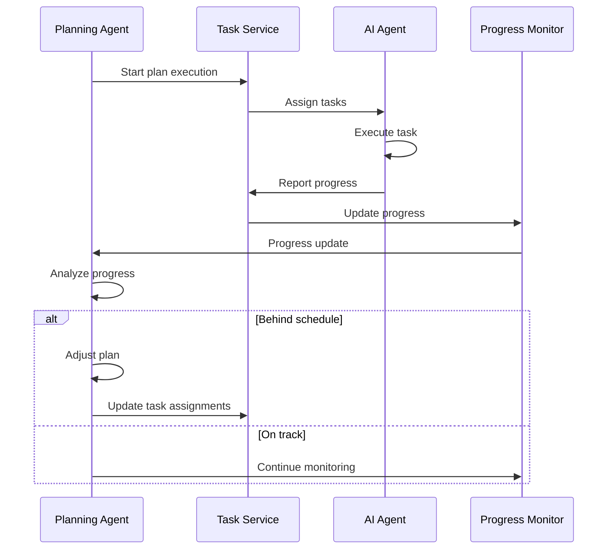

# Planning Agent Design

## 1. Introduction

The Planning Agent is a sophisticated AI-powered component of the SaaS Architecture Spec-Kit system responsible for transforming validated specifications into comprehensive, executable development plans. This agent bridges the gap between high-level requirements and detailed implementation roadmaps while ensuring constitutional compliance and optimal resource allocation.

## 2. Purpose and Scope

The Planning Agent serves as the strategic planning authority within the saasarch speckit ecosystem, converting specifications into actionable development plans that can be executed by various specialized agents.

### Key Responsibilities:

- **Automated Plan Generation**: Create comprehensive development plans from validated specifications
- **Resource Allocation**: Optimize allocation of agents, time, and computational resources
- **Timeline Estimation**: Provide accurate time estimates for project completion
- **Risk Assessment**: Identify and mitigate potential project risks
- **Dependency Management**: Map and manage inter-task dependencies
- **Progress Tracking**: Monitor plan execution and adjust as needed
- **Constitutional Compliance**: Ensure all plans adhere to organizational principles

## 3. Architecture

The Planning Agent will be implemented as a Node.js/TypeScript microservice with advanced AI capabilities for plan generation and optimization. It integrates with multiple services and uses machine learning models for accurate estimation and risk assessment.

### Components:

- **Plan Generator**: Creates development plans from specifications
- **Resource Optimizer**: Optimizes resource allocation and scheduling
- **Timeline Estimator**: Provides accurate time and effort estimates
- **Risk Analyzer**: Identifies and assesses project risks
- **Dependency Mapper**: Maps task dependencies and critical paths
- **Progress Monitor**: Tracks plan execution and performance
- **Plan Optimizer**: Continuously optimizes plans based on feedback

## 4. Data Model

The Planning Agent will use the following data structures:

### Plans Table
| Column | Type | Description |
|--------|------|-------------|
| `id` | `SERIAL` | Primary key |
| `specification_id` | `INTEGER` | Reference to specification |
| `title` | `VARCHAR(255)` | Plan title |
| `description` | `TEXT` | Plan description |
| `plan_embedding` | `VECTOR(1536)` | Vector embedding of the plan |
| `status` | `VARCHAR(50)` | Status (draft, approved, executing, completed, cancelled) |
| `priority` | `INTEGER` | Priority level (1-5) |
| `estimated_duration` | `INTEGER` | Estimated duration in hours |
| `actual_duration` | `INTEGER` | Actual duration in hours |
| `estimated_cost` | `DECIMAL(10,2)` | Estimated cost |
| `actual_cost` | `DECIMAL(10,2)` | Actual cost |
| `risk_score` | `DECIMAL(3,2)` | Risk assessment score (0-1) |
| `complexity_score` | `DECIMAL(3,2)` | Complexity score (0-1) |
| `tenant_id` | `INTEGER` | Reference to tenant |
| `metadata` | `JSONB` | Additional metadata |
| `created_by` | `VARCHAR(255)` | Creator identifier |
| `created_at` | `TIMESTAMPTZ` | Creation timestamp |
| `updated_at` | `TIMESTAMPTZ` | Last update timestamp |

### Plan Phases Table
| Column | Type | Description |
|--------|------|-------------|
| `id` | `SERIAL` | Primary key |
| `plan_id` | `INTEGER` | Reference to plan |
| `name` | `VARCHAR(255)` | Phase name |
| `description` | `TEXT` | Phase description |
| `phase_order` | `INTEGER` | Order within the plan |
| `estimated_duration` | `INTEGER` | Estimated duration in hours |
| `actual_duration` | `INTEGER` | Actual duration in hours |
| `status` | `VARCHAR(50)` | Status (pending, in_progress, completed, blocked) |
| `dependencies` | `JSONB` | Phase dependencies |
| `deliverables` | `JSONB` | Expected deliverables |
| `success_criteria` | `TEXT` | Success criteria for the phase |
| `created_at` | `TIMESTAMPTZ` | Creation timestamp |
| `updated_at` | `TIMESTAMPTZ` | Last update timestamp |

### Plan Tasks Table
| Column | Type | Description |
|--------|------|-------------|
| `id` | `SERIAL` | Primary key |
| `phase_id` | `INTEGER` | Reference to phase |
| `title` | `VARCHAR(255)` | Task title |
| `description` | `TEXT` | Task description |
| `task_embedding` | `VECTOR(1536)` | Vector embedding of the task |
| `task_type` | `VARCHAR(100)` | Type of task (development, testing, documentation, etc.) |
| `assigned_agent_type` | `VARCHAR(100)` | Type of agent assigned to the task |
| `estimated_effort` | `INTEGER` | Estimated effort in hours |
| `actual_effort` | `INTEGER` | Actual effort in hours |
| `priority` | `INTEGER` | Priority level (1-5) |
| `status` | `VARCHAR(50)` | Status (pending, assigned, in_progress, completed, failed) |
| `dependencies` | `JSONB` | Task dependencies |
| `acceptance_criteria` | `TEXT` | Acceptance criteria |
| `metadata` | `JSONB` | Additional metadata |
| `created_at` | `TIMESTAMPTZ` | Creation timestamp |
| `updated_at` | `TIMESTAMPTZ` | Last update timestamp |

### Resource Allocations Table
| Column | Type | Description |
|--------|------|-------------|
| `id` | `SERIAL` | Primary key |
| `plan_id` | `INTEGER` | Reference to plan |
| `resource_type` | `VARCHAR(100)` | Type of resource (agent, compute, storage) |
| `resource_id` | `VARCHAR(255)` | Resource identifier |
| `allocated_amount` | `DECIMAL(10,2)` | Amount allocated |
| `utilization_rate` | `DECIMAL(3,2)` | Utilization rate (0-1) |
| `allocation_start` | `TIMESTAMPTZ` | Allocation start time |
| `allocation_end` | `TIMESTAMPTZ` | Allocation end time |
| `cost_per_unit` | `DECIMAL(10,2)` | Cost per unit of resource |
| `total_cost` | `DECIMAL(10,2)` | Total allocation cost |
| `created_at` | `TIMESTAMPTZ` | Creation timestamp |

## 5. API Specification

The Planning Agent will expose the following REST API endpoints:

### Plan Management
- `POST /plans` - Create a new plan from specification
- `GET /plans` - List all plans with filtering
- `GET /plans/{id}` - Get a specific plan
- `PUT /plans/{id}` - Update a plan
- `DELETE /plans/{id}` - Cancel/archive a plan
- `POST /plans/{id}/approve` - Approve a plan for execution
- `POST /plans/{id}/execute` - Start plan execution

### Plan Analysis
- `POST /plans/{id}/analyze` - Analyze plan feasibility and risks
- `POST /plans/{id}/optimize` - Optimize plan for efficiency
- `GET /plans/{id}/timeline` - Get detailed timeline
- `GET /plans/{id}/critical-path` - Get critical path analysis
- `GET /plans/{id}/resource-requirements` - Get resource requirements

### Progress Tracking
- `GET /plans/{id}/progress` - Get plan execution progress
- `POST /plans/{id}/update-progress` - Update task progress
- `GET /plans/{id}/metrics` - Get plan performance metrics
- `POST /plans/{id}/adjust` - Adjust plan based on progress

### Resource Management
- `GET /plans/{id}/resources` - Get resource allocations
- `POST /plans/{id}/allocate-resources` - Allocate resources to plan
- `PUT /plans/{id}/resources/{resourceId}` - Update resource allocation

## 6. Core Functionalities

### 6.1 Plan Generation

```typescript
interface PlanGenerator {
  generatePlan(specification: Specification, options: PlanGenerationOptions): Promise<Plan>;
  decomposeTasks(specification: Specification): Promise<Task[]>;
  identifyDependencies(tasks: Task[]): Promise<DependencyGraph>;
  estimateEffort(tasks: Task[]): Promise<EffortEstimate[]>;
  optimizePlan(plan: Plan, constraints: PlanConstraints): Promise<OptimizedPlan>;
}

interface PlanGenerationOptions {
  targetDuration?: number;
  maxResources?: number;
  priorityWeights?: PriorityWeights;
  riskTolerance?: number;
  qualityThreshold?: number;
}

interface Plan {
  id: string;
  specificationId: string;
  title: string;
  description: string;
  phases: Phase[];
  totalEstimatedDuration: number;
  totalEstimatedCost: number;
  riskScore: number;
  complexityScore: number;
  resourceRequirements: ResourceRequirement[];
  criticalPath: Task[];
  milestones: Milestone[];
}

interface Phase {
  id: string;
  name: string;
  description: string;
  order: number;
  tasks: Task[];
  estimatedDuration: number;
  dependencies: string[];
  deliverables: Deliverable[];
  successCriteria: string[];
}

interface Task {
  id: string;
  title: string;
  description: string;
  type: TaskType;
  assignedAgentType: AgentType;
  estimatedEffort: number;
  priority: number;
  dependencies: string[];
  acceptanceCriteria: string[];
  metadata: Record<string, any>;
}
```

### 6.2 Resource Optimization

```typescript
interface ResourceOptimizer {
  optimizeResourceAllocation(plan: Plan, availableResources: Resource[]): Promise<ResourceAllocation>;
  balanceWorkload(tasks: Task[], agents: Agent[]): Promise<WorkloadBalance>;
  minimizeCost(plan: Plan, costConstraints: CostConstraints): Promise<CostOptimizedPlan>;
  maximizeParallelism(plan: Plan): Promise<ParallelOptimizedPlan>;
}

interface ResourceAllocation {
  allocations: Allocation[];
  totalCost: number;
  utilizationRate: number;
  bottlenecks: Bottleneck[];
  recommendations: string[];
}

interface Allocation {
  resourceId: string;
  resourceType: ResourceType;
  taskIds: string[];
  startTime: Date;
  endTime: Date;
  utilizationRate: number;
  cost: number;
}

enum ResourceType {
  AGENT = 'agent',
  COMPUTE = 'compute',
  STORAGE = 'storage',
  EXTERNAL_SERVICE = 'external_service'
}
```

### 6.3 Risk Assessment

```typescript
interface RiskAnalyzer {
  assessProjectRisks(plan: Plan): Promise<RiskAssessment>;
  identifyBottlenecks(plan: Plan): Promise<Bottleneck[]>;
  calculateCriticalPath(plan: Plan): Promise<CriticalPathAnalysis>;
  predictDelays(plan: Plan, historicalData: HistoricalData[]): Promise<DelayPrediction>;
  suggestMitigation(risks: Risk[]): Promise<MitigationStrategy[]>;
}

interface RiskAssessment {
  overallRiskScore: number;
  risks: Risk[];
  mitigationStrategies: MitigationStrategy[];
  contingencyPlans: ContingencyPlan[];
}

interface Risk {
  id: string;
  type: RiskType;
  description: string;
  probability: number; // 0-1
  impact: number; // 0-1
  severity: RiskSeverity;
  affectedTasks: string[];
  mitigationActions: string[];
}

enum RiskType {
  TECHNICAL = 'technical',
  RESOURCE = 'resource',
  TIMELINE = 'timeline',
  QUALITY = 'quality',
  EXTERNAL = 'external'
}

enum RiskSeverity {
  LOW = 'low',
  MEDIUM = 'medium',
  HIGH = 'high',
  CRITICAL = 'critical'
}
```

### 6.4 Timeline Estimation

```typescript
interface TimelineEstimator {
  estimateTaskDuration(task: Task, historicalData: HistoricalData[]): Promise<DurationEstimate>;
  calculateProjectTimeline(plan: Plan): Promise<Timeline>;
  identifyMilestones(plan: Plan): Promise<Milestone[]>;
  predictCompletionDate(plan: Plan, startDate: Date): Promise<CompletionPrediction>;
}

interface DurationEstimate {
  optimistic: number;
  realistic: number;
  pessimistic: number;
  confidence: number;
  factors: EstimationFactor[];
}

interface Timeline {
  startDate: Date;
  endDate: Date;
  phases: PhaseTimeline[];
  milestones: Milestone[];
  criticalPath: Task[];
  bufferTime: number;
}

interface Milestone {
  id: string;
  name: string;
  description: string;
  targetDate: Date;
  dependencies: string[];
  deliverables: string[];
  successCriteria: string[];
}
```

## 7. Integration Points

### 7.1 Constitution Service Integration

```typescript
class PlanningAgent {
  constructor(
    private constitutionService: ConstitutionService,
    private specificationService: SpecificationService
  ) {}

  async generatePlan(specificationId: string, tenantId: string): Promise<Plan> {
    // Get validated specification
    const specification = await this.specificationService.getSpecification(specificationId);
    
    // Generate initial plan
    const initialPlan = await this.planGenerator.generatePlan(specification);
    
    // Validate plan against constitutional principles
    const planValidation = await this.constitutionService.evaluate({
      action: `Create development plan: ${initialPlan.title}`,
      tenantId,
      metadata: {
        agent: 'planning-agent',
        specificationId,
        taskCount: this.countTasks(initialPlan),
        estimatedDuration: initialPlan.totalEstimatedDuration
      }
    });

    if (planValidation.compliance === 'FAIL') {
      throw new ConstitutionalViolationError(
        `Plan violates constitutional principles: ${planValidation.violations.map(v => v.description).join(', ')}`
      );
    }

    // Apply constitutional recommendations
    if (planValidation.recommendations.length > 0) {
      return await this.applyConstitutionalRecommendations(initialPlan, planValidation.recommendations);
    }

    return initialPlan;
  }

  private async applyConstitutionalRecommendations(plan: Plan, recommendations: string[]): Promise<Plan> {
    // Implement logic to adjust plan based on constitutional recommendations
    // This might involve adding security tasks, compliance checks, etc.
    return plan;
  }
}
```

### 7.2 Agent Service Integration

```typescript
interface AgentServiceIntegration {
  getAvailableAgents(agentType: AgentType): Promise<Agent[]>;
  getAgentCapabilities(agentId: string): Promise<AgentCapabilities>;
  estimateAgentEffort(agentId: string, task: Task): Promise<EffortEstimate>;
  reserveAgent(agentId: string, timeSlot: TimeSlot): Promise<Reservation>;
}

class AgentMatcher {
  async matchTasksToAgents(tasks: Task[], availableAgents: Agent[]): Promise<TaskAssignment[]> {
    const assignments: TaskAssignment[] = [];
    
    for (const task of tasks) {
      // Find agents capable of handling this task type
      const capableAgents = availableAgents.filter(agent => 
        this.canHandleTask(agent, task)
      );
      
      if (capableAgents.length === 0) {
        throw new Error(`No available agents can handle task: ${task.title}`);
      }
      
      // Select the best agent based on efficiency, availability, and cost
      const bestAgent = await this.selectBestAgent(capableAgents, task);
      
      assignments.push({
        taskId: task.id,
        agentId: bestAgent.id,
        estimatedEffort: await this.estimateEffort(bestAgent, task),
        confidence: this.calculateConfidence(bestAgent, task)
      });
    }
    
    return assignments;
  }
}
```

### 7.3 Task Service Integration

```typescript
interface TaskServiceIntegration {
  createTasks(planId: string, tasks: Task[]): Promise<CreatedTask[]>;
  updateTaskStatus(taskId: string, status: TaskStatus, metadata?: any): Promise<void>;
  getTaskProgress(planId: string): Promise<TaskProgress[]>;
  notifyTaskCompletion(taskId: string, result: TaskResult): Promise<void>;
}
```

## 8. Workflow Examples

### 8.1 Plan Generation Workflow



### 8.2 Plan Execution Monitoring



## 9. Implementation Details

### 9.1 Plan Generation Algorithm

```typescript
class PlanGenerationEngine {
  async generatePlan(specification: Specification, options: PlanGenerationOptions): Promise<Plan> {
    // Step 1: Decompose specification into tasks
    const tasks = await this.decomposeSpecification(specification);
    
    // Step 2: Identify task dependencies
    const dependencyGraph = await this.buildDependencyGraph(tasks);
    
    // Step 3: Estimate effort for each task
    const effortEstimates = await this.estimateTaskEfforts(tasks);
    
    // Step 4: Group tasks into phases
    const phases = await this.groupTasksIntoPhases(tasks, dependencyGraph);
    
    // Step 5: Optimize plan structure
    const optimizedPlan = await this.optimizePlan(phases, options);
    
    // Step 6: Calculate timeline and resource requirements
    const timeline = await this.calculateTimeline(optimizedPlan);
    const resourceRequirements = await this.calculateResourceRequirements(optimizedPlan);
    
    return {
      id: generateId(),
      specificationId: specification.id,
      title: `Development Plan: ${specification.title}`,
      description: `Automated development plan for ${specification.title}`,
      phases: optimizedPlan,
      totalEstimatedDuration: timeline.totalDuration,
      totalEstimatedCost: resourceRequirements.totalCost,
      riskScore: await this.calculateRiskScore(optimizedPlan),
      complexityScore: await this.calculateComplexityScore(optimizedPlan),
      resourceRequirements: resourceRequirements.requirements,
      criticalPath: timeline.criticalPath,
      milestones: timeline.milestones
    };
  }

  private async decomposeSpecification(specification: Specification): Promise<Task[]> {
    const tasks: Task[] = [];
    
    // Analyze functional requirements
    for (const requirement of specification.functionalRequirements) {
      const functionalTasks = await this.createTasksForRequirement(requirement, 'functional');
      tasks.push(...functionalTasks);
    }
    
    // Analyze non-functional requirements
    for (const requirement of specification.nonFunctionalRequirements) {
      const nonFunctionalTasks = await this.createTasksForRequirement(requirement, 'non-functional');
      tasks.push(...nonFunctionalTasks);
    }
    
    // Add standard tasks (testing, documentation, deployment)
    const standardTasks = await this.createStandardTasks(specification);
    tasks.push(...standardTasks);
    
    return tasks;
  }
}
```

### 9.2 Resource Optimization Algorithm

```typescript
class ResourceOptimizationEngine {
  async optimizeResourceAllocation(plan: Plan, constraints: ResourceConstraints): Promise<ResourceAllocation> {
    // Use genetic algorithm for resource optimization
    const population = this.generateInitialPopulation(plan, constraints);
    
    for (let generation = 0; generation < constraints.maxGenerations; generation++) {
      // Evaluate fitness of each solution
      const fitness = await this.evaluateFitness(population, plan, constraints);
      
      // Select best solutions for reproduction
      const selected = this.selectBest(population, fitness, constraints.selectionRate);
      
      // Create new generation through crossover and mutation
      const newGeneration = this.reproduce(selected, constraints.mutationRate);
      
      population.splice(0, population.length, ...newGeneration);
      
      // Check for convergence
      if (this.hasConverged(fitness)) {
        break;
      }
    }
    
    // Return the best solution
    const bestSolution = this.getBestSolution(population, plan, constraints);
    return this.convertToResourceAllocation(bestSolution, plan);
  }

  private async evaluateFitness(
    population: ResourceSolution[],
    plan: Plan,
    constraints: ResourceConstraints
  ): Promise<number[]> {
    return Promise.all(population.map(solution => this.calculateFitness(solution, plan, constraints)));
  }

  private async calculateFitness(
    solution: ResourceSolution,
    plan: Plan,
    constraints: ResourceConstraints
  ): Promise<number> {
    let fitness = 0;
    
    // Minimize total cost
    const costScore = 1 - (solution.totalCost / constraints.maxCost);
    fitness += costScore * constraints.costWeight;
    
    // Minimize total duration
    const durationScore = 1 - (solution.totalDuration / constraints.maxDuration);
    fitness += durationScore * constraints.durationWeight;
    
    // Maximize resource utilization
    const utilizationScore = solution.averageUtilization;
    fitness += utilizationScore * constraints.utilizationWeight;
    
    // Minimize risk
    const riskScore = 1 - solution.riskScore;
    fitness += riskScore * constraints.riskWeight;
    
    return fitness;
  }
}
```

## 10. Quality Assurance

### 10.1 Plan Quality Metrics

```typescript
interface PlanQualityMetrics {
  feasibilityScore: number; // 0-1
  optimizationScore: number; // 0-1
  riskScore: number; // 0-1
  resourceEfficiencyScore: number; // 0-1
  timelineAccuracyScore: number; // 0-1
  constitutionalComplianceScore: number; // 0-1
  overallQualityScore: number; // 0-1
}

class PlanQualityAssessment {
  assessPlanQuality(plan: Plan, historicalData: HistoricalData[]): PlanQualityMetrics {
    return {
      feasibilityScore: this.assessFeasibility(plan),
      optimizationScore: this.assessOptimization(plan),
      riskScore: this.assessRisk(plan),
      resourceEfficiencyScore: this.assessResourceEfficiency(plan),
      timelineAccuracyScore: this.assessTimelineAccuracy(plan, historicalData),
      constitutionalComplianceScore: this.assessConstitutionalCompliance(plan),
      overallQualityScore: this.calculateOverallScore(plan)
    };
  }
}
```

### 10.2 Automated Testing

```typescript
describe('Planning Agent', () => {
  test('should generate feasible plan from specification', async () => {
    const specification = createTestSpecification();
    
    const plan = await planningAgent.generatePlan(specification.id, 'test-tenant');
    
    expect(plan).toBeDefined();
    expect(plan.phases.length).toBeGreaterThan(0);
    expect(plan.totalEstimatedDuration).toBeGreaterThan(0);
    expect(plan.riskScore).toBeLessThanOrEqual(1);
  });
  
  test('should respect constitutional principles in plan generation', async () => {
    const specification = createSpecificationWithSecurityRequirements();
    
    const plan = await planningAgent.generatePlan(specification.id, 'test-tenant');
    
    // Should include security-related tasks
    const securityTasks = plan.phases.flatMap(phase => phase.tasks)
      .filter(task => task.type === 'security' || task.description.includes('security'));
    
    expect(securityTasks.length).toBeGreaterThan(0);
  });
  
  test('should optimize resource allocation', async () => {
    const plan = createTestPlan();
    const availableResources = createTestResources();
    
    const allocation = await planningAgent.optimizeResourceAllocation(plan, availableResources);
    
    expect(allocation.utilizationRate).toBeGreaterThan(0.7);
    expect(allocation.totalCost).toBeLessThanOrEqual(plan.totalEstimatedCost);
  });
});
```

## 11. Deployment and Operations

### 11.1 Service Configuration

```yaml
# planning-service.yaml
apiVersion: apps/v1
kind: Deployment
metadata:
  name: planning-service
spec:
  replicas: 2
  selector:
    matchLabels:
      app: planning-service
  template:
    metadata:
      labels:
        app: planning-service
    spec:
      containers:
      - name: planning-service
        image: saasarch/planning-service:latest
        ports:
        - containerPort: 3004
        env:
        - name: DATABASE_URL
          valueFrom:
            secretKeyRef:
              name: db-secret
              key: url
        - name: CONSTITUTION_SERVICE_URL
          value: "http://constitution-service:80"
        - name: SPECIFICATION_SERVICE_URL
          value: "http://specification-service:80"
        - name: AGENT_SERVICE_URL
          value: "http://agent-service:80"
        resources:
          requests:
            memory: "512Mi"
            cpu: "250m"
          limits:
            memory: "1Gi"
            cpu: "500m"
```

### 11.2 Monitoring and Alerting

```typescript
// Metrics collection
const planningMetrics = {
  plansGenerated: new Counter('plans_generated_total'),
  planGenerationDuration: new Histogram('plan_generation_duration_seconds'),
  planOptimizationSuccess: new Counter('plan_optimization_success_total'),
  resourceUtilization: new Gauge('resource_utilization_rate'),
  planAccuracy: new Gauge('plan_accuracy_score')
};

// Performance monitoring
class PlanningPerformanceMonitor {
  async monitorPlanExecution(planId: string): Promise<void> {
    const plan = await this.getPlan(planId);
    const actualProgress = await this.getActualProgress(planId);
    
    // Calculate accuracy metrics
    const timelineAccuracy = this.calculateTimelineAccuracy(plan, actualProgress);
    const resourceAccuracy = this.calculateResourceAccuracy(plan, actualProgress);
    
    // Update metrics
    planningMetrics.planAccuracy.set(timelineAccuracy);
    
    // Alert on significant deviations
    if (timelineAccuracy < 0.7) {
      await this.alertOnPlanDeviation(planId, timelineAccuracy);
    }
  }
}
```

## 12. Future Enhancements

1. **Machine Learning Integration**: Use ML models to improve estimation accuracy based on historical data
2. **Real-time Plan Adjustment**: Automatically adjust plans based on real-time progress and changing conditions
3. **Multi-project Planning**: Coordinate planning across multiple projects with shared resources
4. **Predictive Analytics**: Predict project outcomes and potential issues before they occur
5. **Integration with External Tools**: Connect with project management tools like Jira, Asana, and Microsoft Project

## 13. Conclusion

The Planning Agent serves as the strategic brain of the SaaS Architecture Spec-Kit ecosystem, transforming specifications into executable plans while ensuring constitutional compliance and optimal resource utilization. By providing automated planning, risk assessment, and continuous optimization, it significantly improves project success rates and development efficiency while maintaining adherence to organizational principles and standards.
