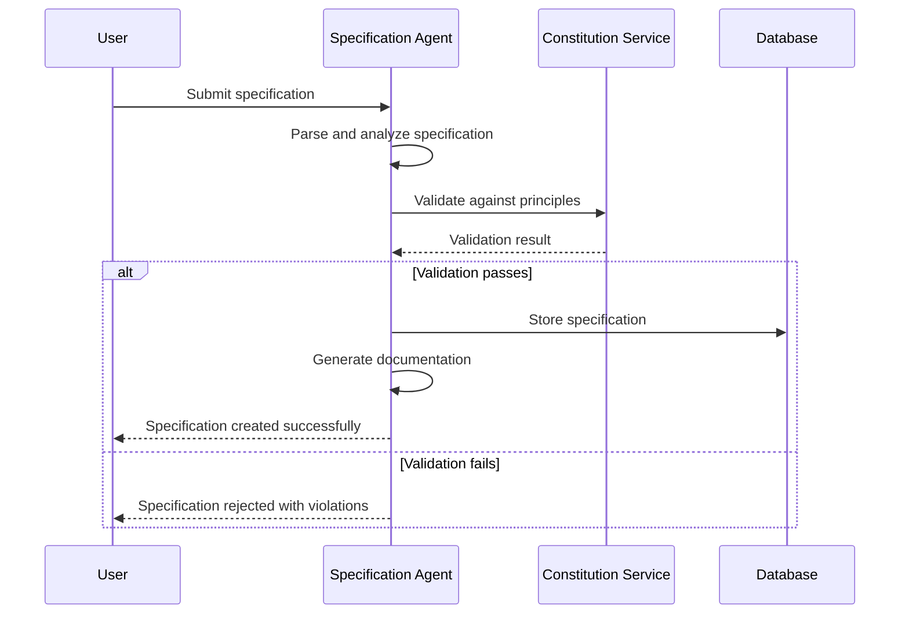
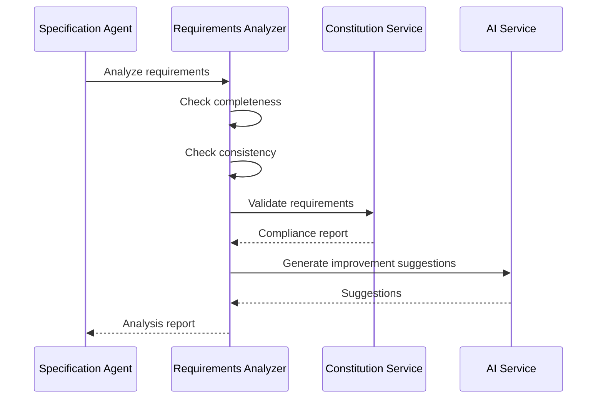

# Specification Agent Design

## 1. Introduction

The Specification Agent is a core component of the SaaS Architecture Spec-Kit system responsible for managing project specifications, requirements documentation, and ensuring specification quality and completeness. This agent acts as the bridge between high-level project requirements and detailed implementation plans.

## 2. Purpose and Scope

The Specification Agent serves as the central authority for all project specifications within the saasarch speckit ecosystem. It ensures that specifications are complete, consistent, and aligned with constitutional principles before they proceed to the planning and implementation phases.

### Key Responsibilities:

- **Specification Management**: Create, update, and version project specifications
- **Requirements Analysis**: Analyze and validate requirements for completeness and consistency
- **Documentation Generation**: Automatically generate comprehensive documentation from specifications
- **Specification Validation**: Ensure specifications comply with organizational standards and constitutional principles
- **Change Impact Analysis**: Assess the impact of specification changes on existing plans and implementations
- **Stakeholder Communication**: Facilitate communication between stakeholders through clear specification artifacts

## 3. Architecture

The Specification Agent will be implemented as a Node.js/TypeScript microservice that integrates with the Constitution Service and other platform components. It will use vector embeddings for semantic analysis of specifications and requirements.

### Components:

- **Specification Parser**: Processes and parses various specification formats (Markdown, JSON, YAML, etc.)
- **Requirements Analyzer**: Analyzes requirements for completeness, consistency, and feasibility
- **Documentation Generator**: Generates comprehensive documentation from specifications
- **Validation Engine**: Validates specifications against constitutional principles and organizational standards
- **Change Tracker**: Tracks changes and analyzes their impact on the broader system
- **Template Engine**: Provides specification templates and best practices

## 4. Data Model

The Specification Agent will use the following data structures:

### Specifications Table
| Column | Type | Description |
|--------|------|-------------|
| `id` | `SERIAL` | Primary key |
| `title` | `VARCHAR(255)` | Specification title |
| `content` | `TEXT` | Specification content in Markdown format |
| `content_embedding` | `VECTOR(1536)` | Vector embedding of the content |
| `version` | `VARCHAR(50)` | Specification version (semantic versioning) |
| `tenant_id` | `INTEGER` | Reference to tenant |
| `status` | `VARCHAR(50)` | Status (draft, review, approved, deprecated) |
| `metadata` | `JSONB` | Additional metadata (tags, categories, etc.) |
| `created_by` | `VARCHAR(255)` | Creator identifier |
| `created_at` | `TIMESTAMPTZ` | Creation timestamp |
| `updated_at` | `TIMESTAMPTZ` | Last update timestamp |

### Requirements Table
| Column | Type | Description |
|--------|------|-------------|
| `id` | `SERIAL` | Primary key |
| `specification_id` | `INTEGER` | Reference to specification |
| `requirement_text` | `TEXT` | Requirement description |
| `requirement_embedding` | `VECTOR(1536)` | Vector embedding of the requirement |
| `type` | `VARCHAR(50)` | Requirement type (functional, non-functional, constraint) |
| `priority` | `INTEGER` | Priority level (1-5) |
| `status` | `VARCHAR(50)` | Status (pending, approved, implemented, rejected) |
| `acceptance_criteria` | `TEXT` | Acceptance criteria for the requirement |
| `created_at` | `TIMESTAMPTZ` | Creation timestamp |
| `updated_at` | `TIMESTAMPTZ` | Last update timestamp |

### Specification Changes Table
| Column | Type | Description |
|--------|------|-------------|
| `id` | `SERIAL` | Primary key |
| `specification_id` | `INTEGER` | Reference to specification |
| `change_type` | `VARCHAR(50)` | Type of change (addition, modification, deletion) |
| `old_content` | `TEXT` | Previous content |
| `new_content` | `TEXT` | New content |
| `change_reason` | `TEXT` | Reason for the change |
| `impact_analysis` | `JSONB` | Impact analysis results |
| `approved_by` | `VARCHAR(255)` | Approver identifier |
| `created_at` | `TIMESTAMPTZ` | Change timestamp |

## 5. API Specification

The Specification Agent will expose the following REST API endpoints:

### Specification Management
- `POST /specifications` - Create a new specification
- `GET /specifications` - List all specifications with filtering
- `GET /specifications/{id}` - Get a specific specification
- `PUT /specifications/{id}` - Update a specification
- `DELETE /specifications/{id}` - Archive a specification
- `POST /specifications/{id}/versions` - Create a new version
- `GET /specifications/{id}/versions` - List specification versions

### Requirements Management
- `POST /specifications/{id}/requirements` - Add requirements to a specification
- `GET /specifications/{id}/requirements` - Get requirements for a specification
- `PUT /requirements/{id}` - Update a requirement
- `DELETE /requirements/{id}` - Remove a requirement

### Analysis and Validation
- `POST /specifications/{id}/analyze` - Analyze specification completeness
- `POST /specifications/{id}/validate` - Validate against constitutional principles
- `POST /specifications/{id}/impact-analysis` - Analyze change impact
- `POST /specifications/search` - Semantic search across specifications

### Documentation Generation
- `POST /specifications/{id}/generate-docs` - Generate comprehensive documentation
- `GET /specifications/{id}/docs/{format}` - Get documentation in specific format

## 6. Core Functionalities

### 6.1 Specification Parsing and Processing

```typescript
interface SpecificationProcessor {
  parseSpecification(content: string, format: SpecificationFormat): ParsedSpecification;
  extractRequirements(specification: ParsedSpecification): Requirement[];
  generateEmbeddings(content: string): Promise<number[]>;
  validateStructure(specification: ParsedSpecification): ValidationResult;
}

enum SpecificationFormat {
  MARKDOWN = 'markdown',
  JSON = 'json',
  YAML = 'yaml',
  GHERKIN = 'gherkin'
}

interface ParsedSpecification {
  title: string;
  description: string;
  requirements: Requirement[];
  constraints: Constraint[];
  assumptions: string[];
  dependencies: Dependency[];
  metadata: Record<string, any>;
}
```

### 6.2 Requirements Analysis

```typescript
interface RequirementsAnalyzer {
  analyzeCompleteness(requirements: Requirement[]): CompletenessReport;
  checkConsistency(requirements: Requirement[]): ConsistencyReport;
  assessFeasibility(requirements: Requirement[]): FeasibilityReport;
  identifyConflicts(requirements: Requirement[]): ConflictReport;
  suggestImprovements(requirements: Requirement[]): ImprovementSuggestion[];
}

interface CompletenessReport {
  score: number; // 0-1
  missingAreas: string[];
  recommendations: string[];
  requiredAdditions: RequirementSuggestion[];
}

interface RequirementSuggestion {
  type: RequirementType;
  description: string;
  rationale: string;
  priority: number;
}
```

### 6.3 Constitutional Validation

```typescript
interface ConstitutionalValidator {
  validateSpecification(specification: ParsedSpecification, tenantId: string): Promise<ValidationResult>;
  validateRequirement(requirement: Requirement, tenantId: string): Promise<ValidationResult>;
  checkCompliance(content: string, tenantId: string): Promise<ComplianceReport>;
}

interface ComplianceReport {
  overallScore: number;
  compliance: 'PASS' | 'FAIL' | 'WARNING';
  violations: Violation[];
  recommendations: string[];
  affectedPrinciples: Principle[];
}
```

### 6.4 Documentation Generation

```typescript
interface DocumentationGenerator {
  generateTechnicalSpec(specification: ParsedSpecification): TechnicalSpecification;
  generateUserStories(requirements: Requirement[]): UserStory[];
  generateAPIDocumentation(specification: ParsedSpecification): APIDocumentation;
  generateTestPlan(requirements: Requirement[]): TestPlan;
  generateArchitectureDiagram(specification: ParsedSpecification): ArchitectureDiagram;
}

interface TechnicalSpecification {
  overview: string;
  architecture: ArchitectureSection;
  requirements: RequirementSection[];
  interfaces: InterfaceSection[];
  dataModels: DataModelSection[];
  securityConsiderations: SecuritySection;
  performanceRequirements: PerformanceSection;
}
```

## 7. Integration Points

### 7.1 Constitution Service Integration

The Specification Agent integrates closely with the Constitution Service to ensure all specifications comply with organizational principles:

```typescript
class SpecificationAgent {
  constructor(
    private constitutionService: ConstitutionService,
    private embeddingService: EmbeddingService
  ) {}

  async validateSpecification(specification: ParsedSpecification, tenantId: string): Promise<ValidationResult> {
    // Generate embedding for the entire specification
    const specEmbedding = await this.embeddingService.generateEmbedding(
      `${specification.title} ${specification.description} ${specification.requirements.map(r => r.text).join(' ')}`
    );

    // Validate against constitutional principles
    const constitutionalValidation = await this.constitutionService.evaluate({
      action: `Create specification: ${specification.title}`,
      tenantId,
      metadata: {
        agent: 'specification-agent',
        specificationId: specification.id,
        requirementCount: specification.requirements.length
      }
    });

    return {
      isValid: constitutionalValidation.compliance !== 'FAIL',
      score: constitutionalValidation.overallScore,
      violations: constitutionalValidation.violations,
      recommendations: constitutionalValidation.recommendations
    };
  }
}
```

### 7.2 Agent Builder Integration

The Specification Agent provides specifications to the Agent Builder for agent creation:

```typescript
interface AgentBuilderIntegration {
  getAgentSpecifications(agentType: string): Promise<AgentSpecification[]>;
  validateAgentRequirements(requirements: AgentRequirement[]): Promise<ValidationResult>;
  generateAgentDocumentation(agentSpec: AgentSpecification): Promise<Documentation>;
}
```

### 7.3 Planning Service Integration

The Specification Agent feeds validated specifications to the Planning Service:

```typescript
interface PlanningServiceIntegration {
  submitSpecificationForPlanning(specificationId: string): Promise<PlanningRequest>;
  getSpecificationChanges(specificationId: string, fromVersion: string): Promise<ChangeSet>;
  notifyPlanningOfChanges(changes: ChangeSet): Promise<void>;
}
```

## 8. Workflow Examples

### 8.1 Specification Creation Workflow



### 8.2 Requirements Analysis Workflow



## 9. Implementation Details

### 9.1 Specification Templates

The agent will provide templates for common specification types:

```typescript
interface SpecificationTemplate {
  id: string;
  name: string;
  description: string;
  category: string;
  template: string;
  requiredSections: string[];
  optionalSections: string[];
  validationRules: ValidationRule[];
}

const webApplicationTemplate: SpecificationTemplate = {
  id: 'web-app-template',
  name: 'Web Application Specification',
  description: 'Template for web application specifications',
  category: 'web-development',
  template: `
# {{title}}

## Overview
{{description}}

## Functional Requirements
{{#each functionalRequirements}}
- {{this}}
{{/each}}

## Non-Functional Requirements
{{#each nonFunctionalRequirements}}
- {{this}}
{{/each}}

## User Interface Requirements
{{uiRequirements}}

## Security Requirements
{{securityRequirements}}

## Performance Requirements
{{performanceRequirements}}
  `,
  requiredSections: ['overview', 'functionalRequirements', 'securityRequirements'],
  optionalSections: ['nonFunctionalRequirements', 'uiRequirements', 'performanceRequirements'],
  validationRules: [
    { field: 'title', rule: 'required', message: 'Title is required' },
    { field: 'description', rule: 'minLength:50', message: 'Description must be at least 50 characters' }
  ]
};
```

### 9.2 Semantic Search Implementation

```typescript
class SpecificationSearchService {
  async searchSpecifications(query: string, tenantId: string, options: SearchOptions = {}): Promise<SearchResult[]> {
    // Generate embedding for the search query
    const queryEmbedding = await this.embeddingService.generateEmbedding(query);
    
    // Perform vector similarity search
    const results = await this.database.query(`
      SELECT 
        s.id,
        s.title,
        s.content,
        s.version,
        s.status,
        1 - (s.content_embedding <=> $1::vector) as similarity
      FROM specifications s
      WHERE s.tenant_id = $2
        AND s.status != 'archived'
        AND 1 - (s.content_embedding <=> $1::vector) > $3
      ORDER BY similarity DESC
      LIMIT $4
    `, [
      `[${queryEmbedding.join(',')}]`,
      tenantId,
      options.threshold || 0.7,
      options.limit || 10
    ]);
    
    return results.map(row => ({
      specification: {
        id: row.id,
        title: row.title,
        content: row.content,
        version: row.version,
        status: row.status
      },
      similarity: row.similarity,
      relevantSections: this.extractRelevantSections(row.content, query)
    }));
  }
}
```

## 10. Quality Assurance

### 10.1 Specification Quality Metrics

```typescript
interface QualityMetrics {
  completenessScore: number; // 0-1
  consistencyScore: number; // 0-1
  clarityScore: number; // 0-1
  testabilityScore: number; // 0-1
  constitutionalComplianceScore: number; // 0-1
  overallQualityScore: number; // 0-1
}

class QualityAssessment {
  assessSpecificationQuality(specification: ParsedSpecification): QualityMetrics {
    return {
      completenessScore: this.assessCompleteness(specification),
      consistencyScore: this.assessConsistency(specification),
      clarityScore: this.assessClarity(specification),
      testabilityScore: this.assessTestability(specification),
      constitutionalComplianceScore: this.assessConstitutionalCompliance(specification),
      overallQualityScore: this.calculateOverallScore(specification)
    };
  }
}
```

### 10.2 Automated Testing

```typescript
describe('Specification Agent', () => {
  test('should validate specification against constitutional principles', async () => {
    const specification = {
      title: 'User Authentication System',
      description: 'System for user authentication with plain text password storage',
      requirements: [
        { text: 'Store user passwords in plain text', type: 'functional' }
      ]
    };
    
    const result = await specificationAgent.validateSpecification(specification, 'test-tenant');
    
    expect(result.isValid).toBe(false);
    expect(result.violations).toContainEqual(
      expect.objectContaining({
        category: 'Security',
        description: expect.stringContaining('plain text password')
      })
    );
  });
  
  test('should generate comprehensive documentation', async () => {
    const specification = createValidSpecification();
    
    const documentation = await specificationAgent.generateDocumentation(specification);
    
    expect(documentation).toHaveProperty('technicalSpec');
    expect(documentation).toHaveProperty('userStories');
    expect(documentation).toHaveProperty('testPlan');
    expect(documentation.technicalSpec.requirements).toHaveLength(specification.requirements.length);
  });
});
```

## 11. Deployment and Operations

### 11.1 Service Configuration

```yaml
# specification-service.yaml
apiVersion: apps/v1
kind: Deployment
metadata:
  name: specification-service
spec:
  replicas: 2
  selector:
    matchLabels:
      app: specification-service
  template:
    metadata:
      labels:
        app: specification-service
    spec:
      containers:
      - name: specification-service
        image: saasarch/specification-service:latest
        ports:
        - containerPort: 3003
        env:
        - name: DATABASE_URL
          valueFrom:
            secretKeyRef:
              name: db-secret
              key: url
        - name: CONSTITUTION_SERVICE_URL
          value: "http://constitution-service:80"
        - name: OPENAI_API_KEY
          valueFrom:
            secretKeyRef:
              name: openai-secret
              key: api-key
```

### 11.2 Monitoring and Alerting

```typescript
// Metrics collection
const specificationMetrics = {
  specificationsCreated: new Counter('specifications_created_total'),
  validationFailures: new Counter('specification_validation_failures_total'),
  documentationGenerated: new Counter('documentation_generated_total'),
  searchQueries: new Counter('specification_search_queries_total'),
  averageQualityScore: new Gauge('specification_average_quality_score')
};

// Health check
app.get('/health', async (req, res) => {
  const health = {
    status: 'healthy',
    timestamp: new Date().toISOString(),
    service: 'specification-service',
    checks: {
      database: await checkDatabaseConnection(),
      constitutionService: await checkConstitutionService(),
      embeddingService: await checkEmbeddingService()
    }
  };
  
  const isHealthy = Object.values(health.checks).every(check => check.status === 'ok');
  res.status(isHealthy ? 200 : 503).json(health);
});
```

## 12. Future Enhancements

1. **AI-Powered Specification Generation**: Automatically generate specifications from high-level descriptions
2. **Visual Specification Editor**: Web-based editor with real-time validation and suggestions
3. **Specification Marketplace**: Share and reuse specification templates across organizations
4. **Integration with External Tools**: Connect with JIRA, Confluence, and other project management tools
5. **Advanced Analytics**: Provide insights into specification quality trends and improvement opportunities

## 13. Conclusion

The Specification Agent serves as a critical component in the SaaS Architecture Spec-Kit ecosystem, ensuring that all project specifications are complete, consistent, and constitutionally compliant. By providing automated analysis, validation, and documentation generation, it significantly improves the quality and efficiency of the specification process while maintaining adherence to organizational principles and standards.
